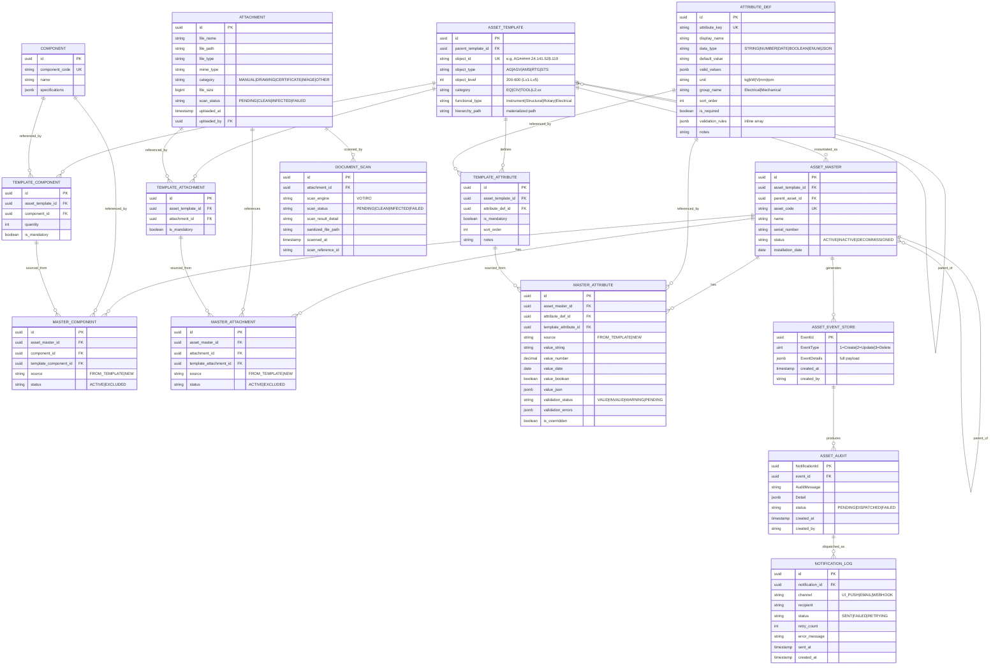
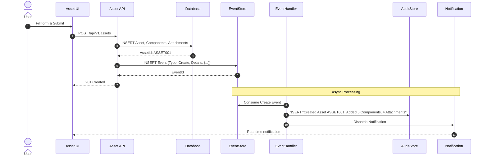
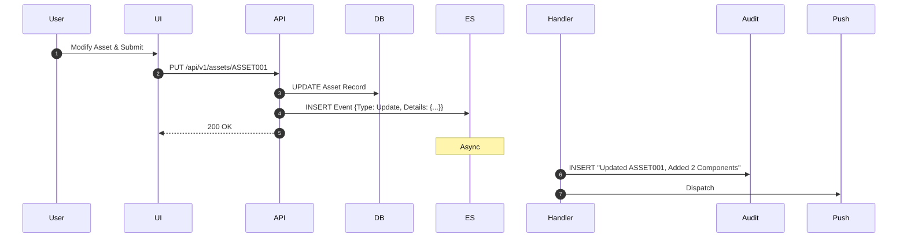

# 1. ARCHITECTURE — Asset Master System

> **Purpose:** Complete system design, data model, ER diagrams

---

## System Overview

```
┌─────────────────────────────────────────────────────────┐
│           Asset Master System (Event-Driven)            │
├──────────────────────────────────────────────────────────┤
│                                                          │
│  User Creates/Updates Asset in UI                       │
│           ↓                                              │
│  API validates & persists (ASSET_MASTER, etc.)          │
│           ↓                                              │
│  Event published to ASSET_EVENT_STORE (immutable)       │
│           ↓                                              │
│  AssetEventHandler consumes → generates audit message   │
│           ↓                                              │
│  NotificationHandler dispatches (UI, email, webhook)    │
│           ↓                                              │
│  DocumentHandler processes file uploads + Votiro scan   │
│           ↓                                              │
│  User sees real-time notification                       │
│                                                          │
└──────────────────────────────────────────────────────────┘
```

---

## Complete ER Diagram (All 16 Entities)



---

## Domain Splits (4 Focus Areas)

### 1. Core Asset Domain

**Tables:** ASSET_TEMPLATE, ASSET_MASTER

**Purpose:** Hierarchical asset structure mirroring GOS Register (APMT-MnR-SOP-0080-102)

**Levels:**
- Lv1 (200): e.g., AG##### (equipment group)
- Lv2 (300): e.g., AG#####.24 (location)
- Lv3 (400): e.g., AG#####.24.141 (sub-location)
- Lv4 (500): e.g., AG#####.24.141.528 (assembly)
- Lv5 (600): e.g., AG#####.24.141.528.119 (component)

**Self-referencing:** `parent_template_id` enables hierarchy

---

### 2. Attributes Domain

**Tables:** ATTRIBUTE_DEF, TEMPLATE_ATTRIBUTE, MASTER_ATTRIBUTE

**Key Concept:** Shared catalog pattern (same as Components)

- **ATTRIBUTE_DEF:** Reusable definition (key, type, rules, defaults)
- **TEMPLATE_ATTRIBUTE:** Template → Attribute link + mandatory flag
- **MASTER_ATTRIBUTE:** Asset → Attribute link + value + validation status

**Storage:** Single ATTRIBUTE_DEF shared across 100+ assets = 98% storage savings

---

### 3. Components & Attachments Domain

**Tables:** COMPONENT, ATTACHMENT, TEMPLATE_*, MASTER_*

**Pattern:** 3-table junctions (identical structure for both)

```
COMPONENT (catalog)
    ↓
TEMPLATE_COMPONENT (link)
    ↓
MASTER_COMPONENT (value on asset)
```

---

### 4. Event & Audit Domain

**Tables:** ASSET_EVENT_STORE, ASSET_AUDIT, NOTIFICATION_LOG, DOCUMENT_SCAN

**Pattern:** Immutable event log → audit generation → notification dispatch

```
Event → Audit → Notification
(1 row)   (1 row)   (1-3 rows)
```

---

## Data Model Details

### ASSET_TEMPLATE
```sql
CREATE TABLE asset_template (
    id UUID PRIMARY KEY DEFAULT gen_random_uuid(),
    parent_template_id UUID REFERENCES asset_template(id),
    object_id VARCHAR(50) UNIQUE NOT NULL,  -- e.g., AG#####.24.141.528.119
    object_type VARCHAR(20) NOT NULL,        -- AG, AGV, AMS, RTG, STS
    object_level INT NOT NULL,               -- 200=Lv1, ..., 600=Lv5
    category VARCHAR(20) NOT NULL,           -- EQ, CIV, TOOL, L2.xx
    functional_type VARCHAR(50),             -- Instrument, Structural, Rotary
    hierarchy_path VARCHAR(255) NOT NULL,    -- materialized path for indexing
    created_at TIMESTAMP DEFAULT CURRENT_TIMESTAMP,
    updated_at TIMESTAMP DEFAULT CURRENT_TIMESTAMP
);
```

**Indexes:**
- `object_id` (UNIQUE)
- `hierarchy_path` (for hierarchy traversal)
- `object_level` (for filtering by level)

---

### ASSET_MASTER
```sql
CREATE TABLE asset_master (
    id UUID PRIMARY KEY DEFAULT gen_random_uuid(),
    asset_template_id UUID NOT NULL REFERENCES asset_template(id),
    parent_asset_id UUID REFERENCES asset_master(id),
    asset_code VARCHAR(50) UNIQUE NOT NULL,
    name VARCHAR(255) NOT NULL,
    serial_number VARCHAR(100),
    status VARCHAR(20) DEFAULT 'ACTIVE',     -- ACTIVE, INACTIVE, DECOMMISSIONED
    installation_date DATE,
    created_at TIMESTAMP DEFAULT CURRENT_TIMESTAMP,
    updated_at TIMESTAMP DEFAULT CURRENT_TIMESTAMP
);
```

**Indexes:**
- `asset_code` (UNIQUE)
- `asset_template_id` (foreign key)
- `parent_asset_id` (hierarchy)
- `status` (for filtering)

---

### ATTRIBUTE_DEF
```sql
CREATE TABLE attribute_def (
    id UUID PRIMARY KEY DEFAULT gen_random_uuid(),
    attribute_key VARCHAR(100) UNIQUE NOT NULL,
    display_name VARCHAR(200) NOT NULL,
    data_type VARCHAR(20) NOT NULL,          -- STRING, NUMBER, DATE, BOOLEAN, ENUM, JSON
    default_value VARCHAR(500),
    valid_values JSONB,                      -- For ENUM: ["Low", "Medium", "High"]
    unit VARCHAR(50),                        -- kg, kW, V, mm, rpm
    group_name VARCHAR(100),                 -- UI grouping: Electrical, Mechanical
    sort_order INT DEFAULT 0,
    is_required BOOLEAN DEFAULT FALSE,
    validation_rules JSONB NOT NULL DEFAULT '[]',  -- Array of rule objects
    notes TEXT,
    created_at TIMESTAMP DEFAULT CURRENT_TIMESTAMP
);
```

**Validation Rules Structure:**
```json
[
  {
    "type": "REQUIRED|MIN_VALUE|MAX_VALUE|MIN_LENGTH|MAX_LENGTH|REGEX|ENUM|DATE_RANGE",
    "value": "depends on type",
    "message": "User-facing error message",
    "severity": "ERROR|WARNING",
    "active": true
  }
]
```

**Indexes:**
- `attribute_key` (UNIQUE)
- `group_name` (for UI grouping)

---

### MASTER_ATTRIBUTE
```sql
CREATE TABLE master_attribute (
    id UUID PRIMARY KEY DEFAULT gen_random_uuid(),
    asset_master_id UUID NOT NULL REFERENCES asset_master(id),
    attribute_def_id UUID NOT NULL REFERENCES attribute_def(id),
    template_attribute_id UUID REFERENCES template_attribute(id),
    source VARCHAR(20) NOT NULL,             -- FROM_TEMPLATE or NEW
    value_string VARCHAR(500),
    value_number DECIMAL(18, 4),
    value_date DATE,
    value_boolean BOOLEAN,
    value_json JSONB,
    validation_status VARCHAR(20) DEFAULT 'PENDING',  -- VALID, INVALID, WARNING, PENDING
    validation_errors JSONB,                 -- Snapshot of failed rules
    is_overridden BOOLEAN DEFAULT FALSE,     -- True if differs from default
    created_at TIMESTAMP DEFAULT CURRENT_TIMESTAMP,
    updated_at TIMESTAMP DEFAULT CURRENT_TIMESTAMP,
    UNIQUE(asset_master_id, attribute_def_id)
);
```

**Indexes:**
- `asset_master_id` (for asset queries)
- `attribute_def_id` (for attribute queries)
- `validation_status` (for filtering invalid records)

---

### ASSET_EVENT_STORE
```sql
CREATE TABLE asset_event_store (
    event_id UUID PRIMARY KEY DEFAULT gen_random_uuid(),
    event_type SMALLINT NOT NULL,            -- 1=Create, 2=Update, 3=Delete
    event_details JSONB NOT NULL,            -- Full asset snapshot at time of event
    created_at TIMESTAMP DEFAULT CURRENT_TIMESTAMP,
    created_by VARCHAR(100) NOT NULL,
    INDEX event_created_at (created_at DESC) -- For efficient time-range queries
);
```

**Event Details Structure:**
```json
{
  "assetId": "uuid",
  "assetCode": "ASSET001",
  "modifiedFields": ["serial_number", "status"],
  "componentCount": 5,
  "attachmentCount": 4,
  "before": { /* full snapshot before */ },
  "after": { /* full snapshot after */ }
}
```

---

### ASSET_AUDIT
```sql
CREATE TABLE asset_audit (
    notification_id UUID PRIMARY KEY DEFAULT gen_random_uuid(),
    event_id UUID NOT NULL REFERENCES asset_event_store(event_id),
    audit_message VARCHAR(500) NOT NULL,
    detail JSONB NOT NULL,                   -- Snapshot of event
    status VARCHAR(20) DEFAULT 'PENDING',    -- PENDING, DISPATCHED, FAILED
    created_at TIMESTAMP DEFAULT CURRENT_TIMESTAMP,
    created_by VARCHAR(100) NOT NULL,
    INDEX audit_created_at (created_at DESC)
);
```

---

## Sequence Diagrams

### Asset Create Flow



### Asset Update Flow



---

## Performance Optimization

### Indexes Strategy

| Table | Index | Reason |
|-------|-------|--------|
| ASSET_MASTER | asset_code | Unique lookups |
| ASSET_MASTER | asset_template_id | Template filtering |
| MASTER_ATTRIBUTE | asset_master_id | Asset attribute queries |
| MASTER_ATTRIBUTE | validation_status | Find invalid records |
| ASSET_EVENT_STORE | created_at DESC | Time-range queries |
| ASSET_AUDIT | created_at DESC | Audit trail pagination |

### Partitioning Strategy

For tables exceeding 100M rows (ASSET_AUDIT, MASTER_ATTRIBUTE):
- **Partition by:** created_at (monthly or quarterly)
- **Benefits:** Faster archival, parallel scans, reduced index size

---

## Scalability Considerations

| Scenario | Estimated Scale | Mitigation |
|----------|-----------------|------------|
| 100K assets × 50 attributes | 5M MASTER_ATTRIBUTE rows | Partition, index on asset_id |
| 10M audit entries/year | Growing table | Archive to historical DB |
| 1000 concurrent users | Peak load | Message queue, read replicas |
| 10 TB file storage | File blobs | S3/Azure Blob, CDN caching |

---

## Next Steps

1. **Implementation:** See [8_HANDLERS_IMPLEMENTATION.md](./8_HANDLERS_IMPLEMENTATION.md)
2. **API Design:** See [9_API_ENDPOINTS.md](./9_API_ENDPOINTS.md)
3. **Integration:** See [10_INTEGRATION_GUIDE.md](./10_INTEGRATION_GUIDE.md)

---

**File:** 1_ARCHITECTURE.md | **Lines:** ~300
