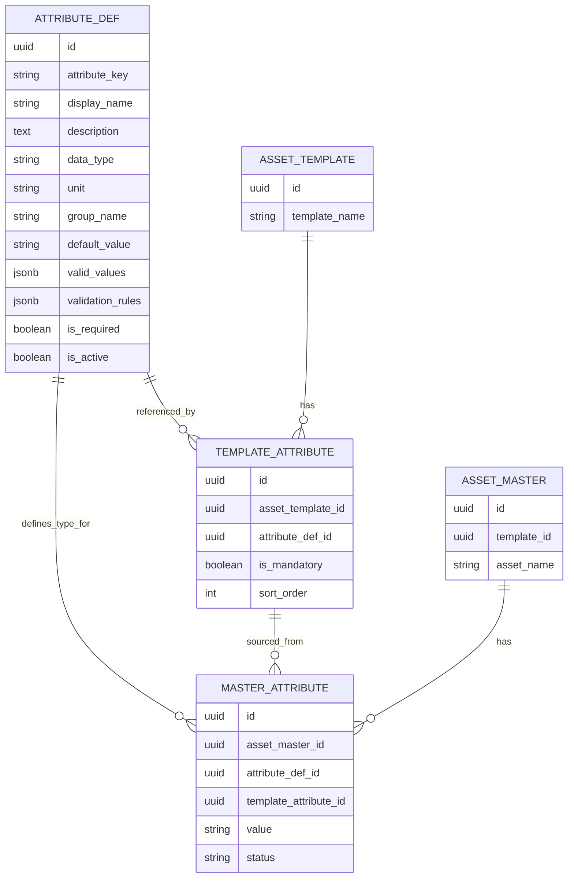

# Attribute Management — Visual Overview

> **Focus:** Data model diagrams, inheritance flow | **No lengthy code**

---

## 1. Attribute Inheritance Model

```
┌─────────────────────────────────────────────────────────────┐
│                  GLOBAL DEFINITIONS                        │
│                    (ATTRIBUTE_DEF)                         │
└────────────────┬────────────────────────────────────────────┘
                 │
        ┌────────┼────────┬─────────┐
        ↓        ↓        ↓         ↓
     ┌──────┐ ┌──────┐ ┌──────┐ ┌──────┐
     │Make  │ │Model │ │Year  │ │VIN   │
     │(STR) │ │(STR) │ │(NUM) │ │(STR) │
     └──────┘ └──────┘ └──────┘ └──────┘
        │        │        │         │
        └────────┴────────┴─────────┘
                 ↓
     ┌──────────────────────────────┐
     │  ASSIGNED TO TEMPLATES       │
     │    (TEMPLATE_ATTRIBUTE)      │
     └────────┬─────────────────────┘
              │
    ┌─────────┼──────────┐
    ↓         ↓          ↓
 ┌─────┐  ┌────────┐ ┌────────┐
 │Car  │  │Truck   │ │Bike    │
 │Tmpl │  │Template │ │Template│
 └─────┘  └────────┘ └────────┘
    │         │          │
    │   (all inherit Make, Model, Year, VIN)
    │
    └─────────────────────────────┐
              ↓                     ↓
        ┌──────────────┐    ┌──────────────┐
        │ Car adds:    │    │Truck adds:   │
        │ • NumDoors   │    │ • LoadCapacity
        │ • TrunkSize  │    │ • AxleCount  │
        └──────────────┘    └──────────────┘
              ↓                     ↓
    ┌──────────────────────────────┐
    │   INHERITED BY ASSETS        │
    │   (MASTER_ATTRIBUTE values)  │
    └──────────────────────────────┘
              ↓
    ┌──────────────────────────────┐
    │ Asset "My Car" has:          │
    │ • Make: Honda                │
    │ • Model: CR-V                │
    │ • Year: 2023                 │
    │ • VIN: 2HRCF4K7...          │
    │ • NumDoors: 5                │
    │ • TrunkSize: 680L            │
    └──────────────────────────────┘
```

---

## 2. Three-Level Data Structure

```
┌──────────────────────────────────────────────────────────────┐
│ LEVEL 1: ATTRIBUTE DEFINITION (Global, Reusable)           │
├──────────────────────────────────────────────────────────────┤
│                                                              │
│ ATTRIBUTE_DEF                                               │
│ ├─ ID: 550e8400-e29b-41d4-a716-446655440000               │
│ ├─ Key: "max_operating_temp"                              │
│ ├─ Display: "Maximum Operating Temperature"              │
│ ├─ Type: NUMBER                                           │
│ ├─ Unit: "°C"                                             │
│ ├─ Default: 80                                            │
│ ├─ Rules: [REQUIRED, MIN_VALUE(0), MAX_VALUE(200)]       │
│ └─ Status: ACTIVE                                         │
│                                                              │
│ Used by: 5 templates, 120 assets                           │
└──────────────────────────────────────────────────────────────┘

┌──────────────────────────────────────────────────────────────┐
│ LEVEL 2: TEMPLATE ASSIGNMENT (Inheritance Point)           │
├──────────────────────────────────────────────────────────────┤
│                                                              │
│ TEMPLATE_ATTRIBUTE                                          │
│ ├─ Template: "Industrial Equipment"                         │
│ ├─ Attribute: "max_operating_temp" (from ATTRIBUTE_DEF)    │
│ ├─ Mandatory: YES                                           │
│ └─ Sort Order: 3                                            │
│                                                              │
│ Effect:                                                      │
│ • All assets created from this template MUST have this      │
│ • Validation rules inherited from ATTRIBUTE_DEF             │
│ • Can customize: mandatory flag, sort order                 │
└──────────────────────────────────────────────────────────────┘

┌──────────────────────────────────────────────────────────────┐
│ LEVEL 3: MASTER ATTRIBUTE VALUE (Instance Data)            │
├──────────────────────────────────────────────────────────────┤
│                                                              │
│ MASTER_ATTRIBUTE                                            │
│ ├─ Asset: "Compressor-Unit-001"                            │
│ ├─ Attribute: "max_operating_temp"                          │
│ ├─ Value: 150°C                                             │
│ ├─ Status: VALID                                            │
│ └─ Updated: 2024-05-02 14:30:00                            │
│                                                              │
│ Validation:                                                  │
│ ✓ Required? YES (from template)                             │
│ ✓ Type: NUMBER (from definition)                            │
│ ✓ Value >= 0? YES ✓                                         │
│ ✓ Value <= 200? YES ✓                                       │
│ → Status: VALID                                             │
└──────────────────────────────────────────────────────────────┘
```

---

## 3. Core Attribute Data Model

```
ATTRIBUTE PROPERTIES
════════════════════════════════════════════════════════════

Identifier:
  ├─ attribute_key: "engine_power_output"    (unique, snake_case)
  └─ id: UUID                                 (system ID)

Display:
  ├─ display_name: "Engine Power Output"
  ├─ description: "Maximum power in kilowatts"
  └─ group_name: "Engine Specifications"    (UI grouping)

Data Type:
  ├─ STRING:   Text values (max 1000 chars)
  ├─ NUMBER:   Integers/decimals (with optional unit)
  ├─ DATE:     Calendar dates (YYYY-MM-DD)
  ├─ BOOLEAN:  True/False flags
  ├─ ENUM:     Predefined list (e.g., ["Low", "Med", "High"])
  └─ JSON:     Complex nested data

Data Constraints:
  ├─ unit: "kW"                             (optional)
  ├─ default_value: 150                     (fallback value)
  ├─ valid_values: ["Diesel", "Petrol"]     (for ENUM)
  └─ validation_rules: [...]                (see section 4)

Status:
  ├─ is_active: true                        (enabled?)
  ├─ is_required: false                     (mandatory default?)
  └─ sort_order: 5                          (UI display order)
```

---

## 4. Validation Rules

```
RULE TYPES (8 Total)
═════════════════════════════════════════════════════════════

1. REQUIRED
   └─ Value cannot be null/empty
   └─ Example: VIN must be provided

2. MIN_VALUE
   └─ Numeric value >= threshold
   └─ Example: Year >= 1900

3. MAX_VALUE
   └─ Numeric value <= threshold
   └─ Example: Temperature <= 200°C

4. MIN_LENGTH
   └─ String length >= characters
   └─ Example: Email >= 5 chars

5. MAX_LENGTH
   └─ String length <= characters
   └─ Example: Description <= 500 chars

6. REGEX
   └─ Pattern matching
   └─ Example: VIN matches ^[A-Z0-9]{17}$

7. ENUM
   └─ Value in allowed list
   └─ Example: Status in [Active, Inactive, Archived]

8. DATE_RANGE
   └─ Date between start_date and end_date
   └─ Example: Inspection date within last 12 months
```

---

## 5. Attribute Scope Management

```
SCOPE CONTROL
═════════════════════════════════════════════════════════════

Attributes can be scoped to:

1. OBJECT TYPE
   ├─ "Attribute visible only to Asset Objects"
   └─ Example: VIN only for Vehicles, not Tools

2. HIERARCHY LEVEL
   ├─ "Apply only to root assets, not children"
   └─ Example: Serial Number only at Level 0

3. CATEGORY
   ├─ "Apply only to specific category"
   └─ Example: Fuel Type only for Equipment in Vehicles category

4. STATUS
   ├─ "Attribute only for assets in Draft status"
   └─ Example: Inspection fields only for Archived assets

COMBINATION EXAMPLE:
────────────────────
Attribute: "ServiceSchedule"
├─ Object Type: Asset
├─ Level: >= 0 (all levels)
├─ Category: MAINTENANCE_EQUIPMENT
└─ Status: ACTIVE

Result:
└─ Only visible in Maintenance Equipment category assets
```

---

## 6. Attribute Inheritance Flow

```
CREATE NEW ASSET
      ↓
SELECT TEMPLATE
      ↓
┌─────────────────────────────────┐
│  Load Template Attributes       │
│  FROM TEMPLATE_ATTRIBUTE        │
│  (fetch all assigned attributes)│
└─────────────────────────────────┘
      ↓
┌─────────────────────────────────┐
│  Load Attribute Definitions     │
│  FROM ATTRIBUTE_DEF             │
│  (type, unit, rules, defaults)  │
└─────────────────────────────────┘
      ↓
┌─────────────────────────────────┐
│  Build Attribute Form           │
│  • Show required fields first   │
│  • Apply default values         │
│  • Set input types (text, num)  │
└─────────────────────────────────┘
      ↓
USER FILLS FORM
      ↓
┌─────────────────────────────────┐
│  Validate Each Attribute        │
│  • Check mandatory fields       │
│  • Apply rules (MIN/MAX/REGEX)  │
│  • Verify data types            │
└─────────────────────────────────┘
      ↓
[ALL VALID?] → YES → SAVE ASSET
                     ↓
              CREATE MASTER_ATTRIBUTE
              records with values
```

---

## 7. Attribute Lifecycle

```
LIFECYCLE STAGES
═════════════════════════════════════════════════════════════

┌────────────────────────────────────────┐
│ 1. DEFINITION CREATED                  │
│    • Admin defines attribute           │
│    • Set type, rules, defaults         │
│    • Status: DRAFT                     │
└─────────┬──────────────────────────────┘
          ↓
┌────────────────────────────────────────┐
│ 2. ASSIGNED TO TEMPLATE                │
│    • Select templates using attribute  │
│    • Mark as mandatory or optional     │
│    • Status: ACTIVE (in use)           │
└─────────┬──────────────────────────────┘
          ↓
┌────────────────────────────────────────┐
│ 3. INHERITED BY ASSET INSTANCES        │
│    • Assets created with template      │
│    • Attributes automatically included │
│    • Values assigned by users          │
└─────────┬──────────────────────────────┘
          ↓
┌────────────────────────────────────────┐
│ 4. USED IN VALIDATION                  │
│    • Values checked against rules      │
│    • Audit trail recorded              │
│    • Errors flagged for correction     │
└─────────┬──────────────────────────────┘
          ↓
┌────────────────────────────────────────┐
│ 5. ARCHIVED (Optional)                 │
│    • Attribute no longer used          │
│    • Historical data preserved         │
│    • Status: INACTIVE                  │
└────────────────────────────────────────┘
```

---

## 8. ER Diagram — Attribute Tables



---

## 9. Common Use Cases

```
USE CASE 1: Add New Attribute Type
────────────────────────────────────
1. Admin navigates to Attribute Definitions
2. Clicks "New Attribute"
3. Enters key, display name, type (NUMBER), unit (kW)
4. Adds rules: REQUIRED, MIN_VALUE(0), MAX_VALUE(500)
5. Saves → Status: ACTIVE
6. Attribute now available to assign to templates

USE CASE 2: Apply Attribute to Template
─────────────────────────────────────────
1. Admin opens Vehicle template
2. Clicks "Add Attribute"
3. Searches for "max_operating_temp"
4. Selects it, marks as MANDATORY
5. Saves → Now in TEMPLATE_ATTRIBUTE
6. Next new Vehicle asset will include this attribute

USE CASE 3: Fill Asset Attributes
──────────────────────────────────
1. User creates new Asset from Vehicle template
2. Form shows inherited attributes:
   • Make (required, text)
   • Model (required, text)
   • max_operating_temp (required, number, 0-500)
3. User enters: Make=Honda, Model=CR-V, Temp=150
4. System validates: ✓ All required ✓ Temp in range
5. Saves → MASTER_ATTRIBUTE created with values

USE CASE 4: Change Attribute on Asset
──────────────────────────────────────
1. User opens existing asset
2. Updates max_operating_temp: 150 → 160
3. System validates: ✓ In range (0-500)
4. Event published: ASSET_UPDATED
5. Audit trail recorded: who changed, when, old→new
```

---

## 10. Key Differences

| Aspect | ATTRIBUTE_DEF | TEMPLATE_ATTRIBUTE | MASTER_ATTRIBUTE |
|--------|--------------|-------------------|------------------|
| **Level** | Global, shared | Template blueprint | Asset instance |
| **Created by** | Admins (once) | Admins per template | Users per asset |
| **Count** | ~150-200 total | Many (per template) | Thousands (per asset) |
| **Purpose** | Define structure | Inherit to template | Store values |
| **Mutable** | Rarely (versioned) | Occasionally | Frequently |
| **Contains** | Type, rules, unit | Mandatory flag | Actual value |
| **Example** | "max_temp: NUMBER" | "Vehicle.max_temp: Y" | "Car-001.max_temp: 150" |

---

## 11. Performance Optimization

```
CACHING STRATEGY
═════════════════════════════════════════════════════════════

┌─────────────────────────────────┐
│ Cache Layer (In-Memory)         │
├─────────────────────────────────┤
│ • ATTRIBUTE_DEF (all ~150 items)│
│ • COMPONENT definitions          │
│ • Validation rules               │
│ • Cache TTL: 1 hour              │
└─────────────────────────────────┘
           ↓ [Cache Miss]
┌─────────────────────────────────┐
│ Database Query                  │
│ SELECT FROM ATTRIBUTE_DEF       │
│ WHERE is_active = true          │
└─────────────────────────────────┘

BENEFIT: Reduce DB load 90% for attribute lookups
```

---

## Quick Reference

| Term | Definition |
|------|-----------|
| **Attribute** | Named property (e.g., "Engine Power") |
| **Definition** | Global type & rules (ATTRIBUTE_DEF) |
| **Template Attr** | Assignment to template (TEMPLATE_ATTRIBUTE) |
| **Master Attr** | Value on asset instance (MASTER_ATTRIBUTE) |
| **Inheritance** | Assets get template attributes automatically |
| **Scope** | Limits where attribute applies |
| **Validation** | Rules checked before saving |
| **Unit** | Optional measurement (kW, °C, etc.) |

---

## Related Documents

- **Architecture** → [1_ARCHITECTURE.md](./1_ARCHITECTURE.md)
- **Validation Rules** → [4_VALIDATION_RULES.md](./4_VALIDATION_RULES.md)
- **API Reference** → [9_API_ENDPOINTS.md](./9_API_ENDPOINTS.md)
- **Master Visual Guide** → [MASTER_VISUAL_GUIDE.md](./MASTER_VISUAL_GUIDE.md)

---

**Last Updated:** 2026-05-03 | **Version:** 2.0
