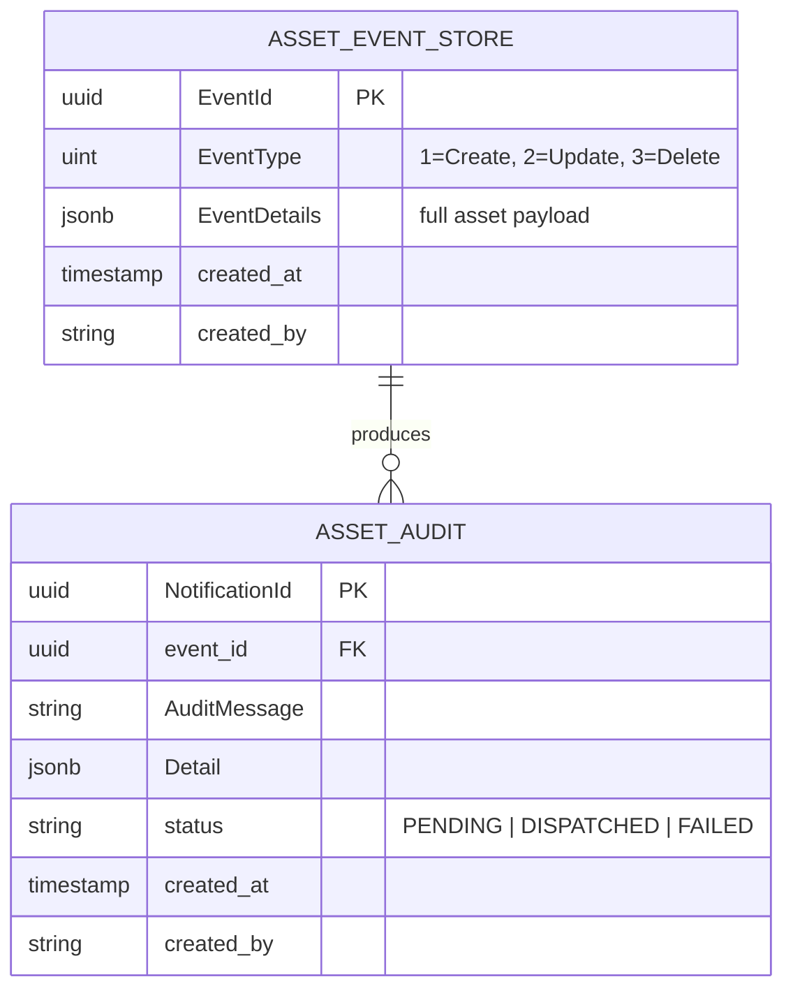
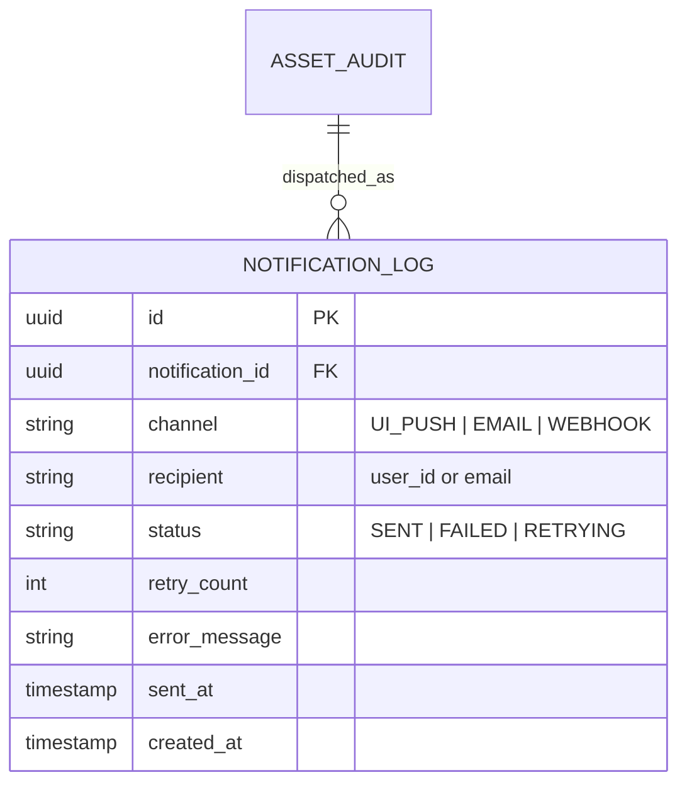
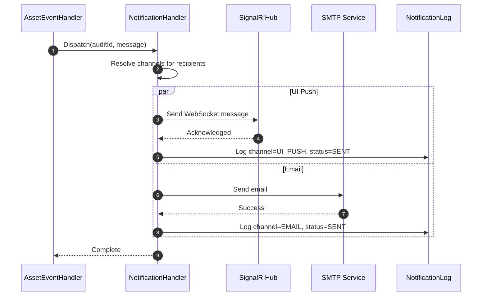
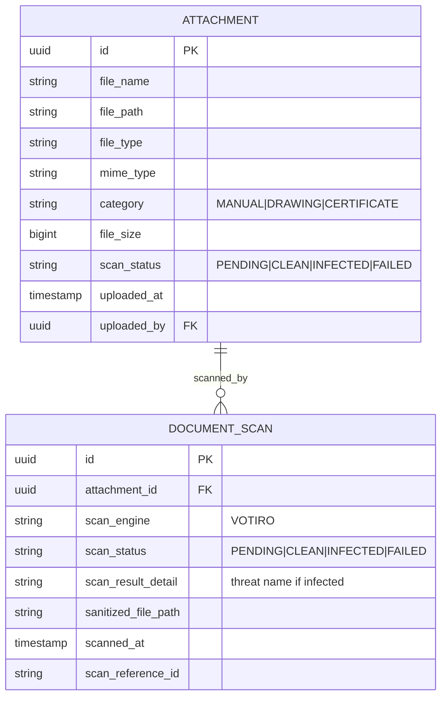

# 7. HANDLERS — Asset Master System

> **Purpose:** 3-handler architecture for event-driven audit trail

---

## Handler Overview

```
API Request
    ↓
ASSET_EVENT_STORE (event published)
    ├─ AssetEventHandler (consumes event)
    │   ├─ Generate audit message
    │   ├─ Insert ASSET_AUDIT record
    │   └─ Call NotificationHandler
    │       └─ NotificationHandler
    │           ├─ Resolve recipient channels
    │           ├─ Send UI push (SignalR)
    │           ├─ Send email (SMTP)
    │           └─ Log to NOTIFICATION_LOG
    │
    ├─ DocumentHandler (file uploads)
    │   ├─ Store file in quarantine
    │   ├─ Submit to Votiro API
    │   └─ Handle scan callback
    │       ├─ If CLEAN → Move to secure storage
    │       ├─ If INFECTED → Delete quarantine
    │       └─ Notify user
```

---

## Handler 1: AssetEventHandler

### Purpose
Consumes events from ASSET_EVENT_STORE → generates audit messages

### Triggers
- New row inserted in ASSET_EVENT_STORE

### Processing

```csharp
public async Task HandleAsync(AssetEvent @event)
{
    // 1. Identify event type
    var auditMessage = @event.Type switch
    {
        EventType.Create => 
            $"Created Asset {id}, Added {components} Components, {attachments} Attachments",
        EventType.Update => 
            $"Updated Asset {id}, Modified Fields: {fields}",
        EventType.Delete => 
            $"Deleted Asset {id}",
    };
    
    // 2. Create audit record
    var audit = new AuditRecord 
    { 
        EventId = @event.EventId,
        Message = auditMessage,
        Status = AuditStatus.Pending
    };
    await _auditDb.InsertAsync(audit);
    
    // 3. Dispatch notification
    await _notificationHandler.DispatchAsync(audit);
    
    // 4. Mark as dispatched
    audit.Status = AuditStatus.Dispatched;
    await _auditDb.UpdateAsync(audit);
}
```

### ER Diagram



### Audit Message Examples

| Event | Message |
|-------|---------|
| Create | "Created Asset ASSET001, Added Components (5), Attachments (4)" |
| Update | "Updated Asset ASSET001, Modified Fields: serial_number, status" |
| Delete | "Deleted Asset ASSET001" |

---

## Handler 2: NotificationHandler

### Purpose
Dispatches audit messages to multiple channels (UI push, email, webhook)

### Triggers
- Called by AssetEventHandler after audit record created

### Channels

| Channel | Technology | Latency | Reliability |
|---------|-----------|---------|-------------|
| **UI_PUSH** | SignalR/WebSocket | 50–100 ms | High (real-time) |
| **EMAIL** | SMTP/SendGrid | 1–5 s | Medium (async) |
| **WEBHOOK** | HTTP POST | 100–500 ms | Medium (with retry) |

### Processing

```csharp
public async Task DispatchAsync(AuditRecord audit)
{
    var recipients = ResolveRecipients(audit);
    var channels = ResolveChannels(recipients);
    
    // Send to all channels in parallel
    var tasks = channels.Select(channel =>
        SendToChannelAsync(channel, audit)
    );
    
    await Task.WhenAll(tasks);
}

private async Task SendToChannelAsync(Channel channel, AuditRecord audit)
{
    var log = new NotificationLog { Channel = channel };
    
    try
    {
        var success = await _channels[channel].SendAsync(audit.Message);
        log.Status = success ? Status.Sent : Status.Failed;
    }
    catch (Exception ex)
    {
        log.Status = Status.Failed;
        log.ErrorMessage = ex.Message;
        // Implement retry logic
    }
    
    await _notificationLogDb.InsertAsync(log);
}
```

### ER Diagram



### Sequence Diagram



### Channel Implementation

```csharp
// UI Notification (SignalR)
public class UINotificationChannel : INotificationChannel
{
    private readonly IHubContext<NotificationHub> _hub;
    
    public async Task<bool> SendAsync(string message)
    {
        await _hub.Clients.All.SendAsync("ReceiveNotification", message);
        return true;
    }
}

// Email Notification (SMTP)
public class EmailNotificationChannel : INotificationChannel
{
    private readonly IEmailService _email;
    
    public async Task<bool> SendAsync(string message)
    {
        await _email.SendAsync(new EmailMessage 
        { 
            To = recipient,
            Subject = "Asset Notification",
            Body = message
        });
        return true;
    }
}

// Webhook Notification (HTTP)
public class WebhookNotificationChannel : INotificationChannel
{
    private readonly HttpClient _http;
    
    public async Task<bool> SendAsync(string message)
    {
        var response = await _http.PostAsJsonAsync(webhookUrl, 
            new { message, timestamp = DateTime.UtcNow });
        return response.IsSuccessStatusCode;
    }
}
```

---

## Handler 3: DocumentHandler

### Purpose
Manages file uploads with Votiro CDR scanning and secure storage

### Triggers
- POST /api/v1/assets/{id}/attachments

### Processing Flow

```
User uploads file
    ↓
Store in quarantine bucket (temporary)
    ↓
Create ATTACHMENT record (scan_status=PENDING)
    ↓
Submit to Votiro API (async)
    ↓
Receive webhook callback (scan complete)
    ├─ CLEAN: Move to permanent storage
    ├─ INFECTED: Delete from quarantine, notify user
    └─ FAILED: Retry or notify admin
```

### Code

```csharp
public async Task<Attachment> UploadAsync(IFormFile file, string assetId)
{
    // 1. Validate file
    ValidateFileUpload(file);
    
    // 2. Store in quarantine
    var tempPath = await _storage.StoreQuarantineAsync(file);
    
    // 3. Create attachment record
    var attachment = new Attachment
    {
        FileName = file.FileName,
        MimeType = file.ContentType,
        ScanStatus = ScanStatus.Pending,
        UploadedAt = DateTime.UtcNow
    };
    await _db.InsertAsync(attachment);
    
    // 4. Submit to Votiro
    var scanRef = await _votiro.SubmitScanAsync(tempPath, attachment.Id);
    
    // 5. Create scan record
    var scan = new DocumentScan
    {
        AttachmentId = attachment.Id,
        ScanReferenceId = scanRef,
        ScanEngine = "VOTIRO",
        ScanStatus = ScanStatus.Pending
    };
    await _db.InsertAsync(scan);
    
    return attachment;
}

// Webhook callback (async)
public async Task HandleScanResultAsync(VotiroWebhook webhook)
{
    var scan = await _db.GetByScanRefAsync(webhook.ReferenceId);
    var attachment = await _db.GetAttachmentAsync(scan.AttachmentId);
    
    if (webhook.Status == "CLEAN")
    {
        // Move file to permanent storage
        var finalPath = await _storage.MoveAsync(scan.FilePath, 
            $"/documents/{attachment.Id}/{attachment.FileName}");
        
        attachment.FilePath = finalPath;
        attachment.ScanStatus = ScanStatus.Clean;
        
        // Notify user
        await _notification.SendAsync($"✅ {attachment.FileName} ready");
    }
    else if (webhook.Status == "INFECTED")
    {
        // Delete quarantine file
        await _storage.DeleteAsync(scan.FilePath);
        attachment.ScanStatus = ScanStatus.Infected;
        
        // Notify user
        await _notification.SendAsync($"❌ {attachment.FileName} failed scan");
    }
    
    await _db.UpdateAsync(attachment);
}
```

### ER Diagram



### Scan Status Flow

```
PENDING → Votiro processes (CDR)
    ↓
┌─────────────────────────────┐
│ CLEAN               INFECTED │
│ Move to storage     Delete   │
│ Ready to download   Blocked  │
└─────────────────────────────┘
```

---

## Handler Comparison

| Feature | AssetEventHandler | NotificationHandler | DocumentHandler |
|---------|-------------------|---------------------|-----------------|
| **Trigger** | ASSET_EVENT_STORE | ASSET_AUDIT | File upload |
| **Consumes** | Event payload | Audit record | File stream |
| **Produces** | ASSET_AUDIT | NOTIFICATION_LOG | DOCUMENT_SCAN |
| **Latency** | 100–500 ms | 50–200 ms | 1–60 s |
| **Async?** | Yes (message queue) | Yes | Yes (Votiro API) |
| **Critical?** | Yes (audit trail) | No (nice to have) | Yes (security) |

---

## Handler Startup Registration

```csharp
// Startup.cs / Program.cs
public void ConfigureServices(IServiceCollection services)
{
    // Event handlers
    services.AddScoped<IEventHandler<AssetEvent>, AssetEventHandler>();
    services.AddScoped<INotificationHandler, NotificationHandler>();
    services.AddScoped<IDocumentHandler, DocumentHandler>();
    
    // Notification channels
    services.AddScoped<INotificationChannel, UINotificationChannel>();
    services.AddScoped<INotificationChannel, EmailNotificationChannel>();
    services.AddScoped<INotificationChannel, WebhookNotificationChannel>();
    
    // External services
    services.AddHttpClient<VotiroScanService>();
    services.AddScoped<IFileStorageService, FileStorageService>();
    services.AddScoped<IEmailService, SmtpEmailService>();
    
    // Message bus
    services.AddRabbitMQEventBus();
    services.AddSignalR();
}

public void Configure(IApplicationBuilder app)
{
    // Subscribe to events
    var eventBus = app.ApplicationServices.GetRequiredService<IEventBus>();
    eventBus.Subscribe<AssetEvent, AssetEventHandler>();
    
    // SignalR endpoint
    app.UseEndpoints(endpoints =>
    {
        endpoints.MapHub<NotificationHub>("/hub/notifications");
    });
}
```

---

## Error Handling & Retry

### Retry Policy (Exponential Backoff)
```csharp
public class RetryPolicy
{
    public static async Task<T> ExecuteAsync<T>(
        Func<Task<T>> operation,
        int maxRetries = 3,
        int initialDelayMs = 1000)
    {
        int delay = initialDelayMs;
        
        for (int i = 0; i < maxRetries; i++)
        {
            try
            {
                return await operation();
            }
            catch (Exception ex) when (i < maxRetries - 1)
            {
                await Task.Delay(delay);
                delay *= 2; // exponential backoff
            }
        }
        
        throw new Exception($"Operation failed after {maxRetries} attempts");
    }
}
```

### Dead Letter Queue (DLQ)
```csharp
public class DeadLetterQueueHandler
{
    public async Task PublishToDeadLetterQueueAsync(AssetEvent @event, Exception ex)
    {
        var dlqMessage = new DeadLetterMessage
        {
            OriginalEvent = @event,
            Exception = ex.Message,
            Timestamp = DateTime.UtcNow,
            RetryCount = 0
        };
        
        await _eventBus.PublishAsync(dlqMessage, queueName: "asset.events.dlq");
    }
}
```

---

## Monitoring & Health Checks

```csharp
public class HandlerHealthCheck : IHealthCheck
{
    public async Task<HealthCheckResult> CheckHealthAsync(HealthCheckContext context)
    {
        var pendingAudits = await _db.CountAsync<AssetAudit>(
            x => x.Status == AuditStatus.Pending);
        
        var failedNotifications = await _db.CountAsync<NotificationLog>(
            x => x.Status == NotificationStatus.Failed && 
                 x.CreatedAt > DateTime.UtcNow.AddHours(-1));
        
        if (pendingAudits > 1000 || failedNotifications > 100)
            return HealthCheckResult.Degraded("Handler backlog detected");
        
        return HealthCheckResult.Healthy();
    }
}
```

---

## Next Steps

1. **Implement handlers:** See [8_HANDLERS_IMPLEMENTATION.md](./8_HANDLERS_IMPLEMENTATION.md)
2. **Configure Votiro:** See [10_INTEGRATION_GUIDE.md](./10_INTEGRATION_GUIDE.md)
3. **Test handlers:** See [HANDLERS_TESTING_GUIDE.md](./HANDLERS_TESTING_GUIDE.md)

---

**File:** 7_HANDLERS.md | **Lines:** ~400
