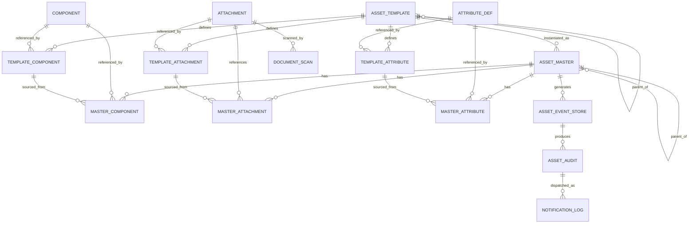
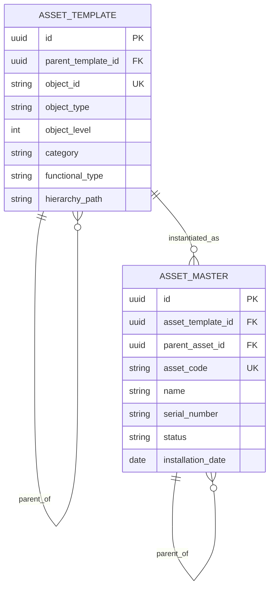
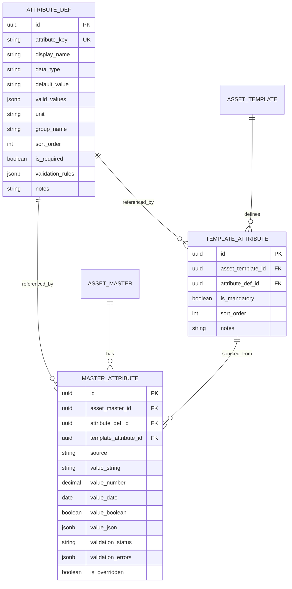
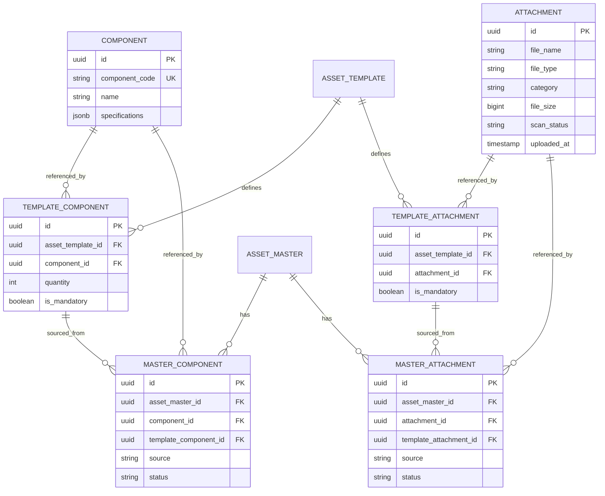
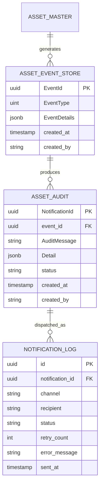
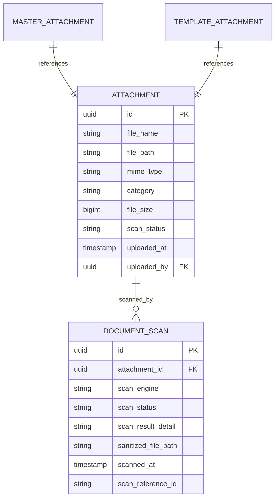

# Asset Master — ER Diagrams

> **Module:** Asset Master System | **Version:** 1.0

---

## 1. Complete ER Diagram

---

## 2. Core Asset Domain

---

## 3. Attributes Domain

---

## 4. Components & Attachments Domain

---

## 5. Event & Audit Domain

---

## 6. Document Scan Domain

