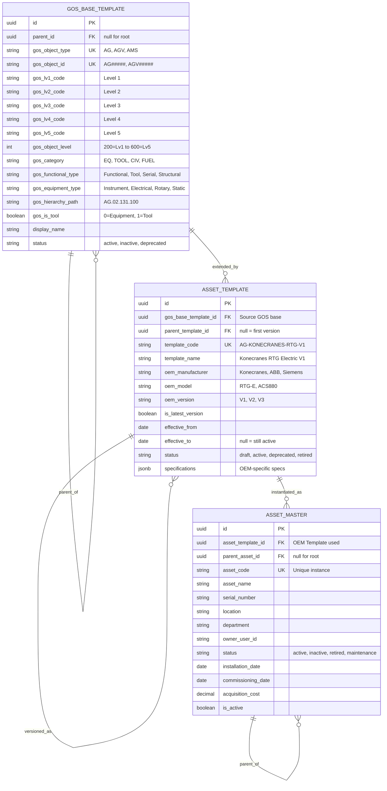
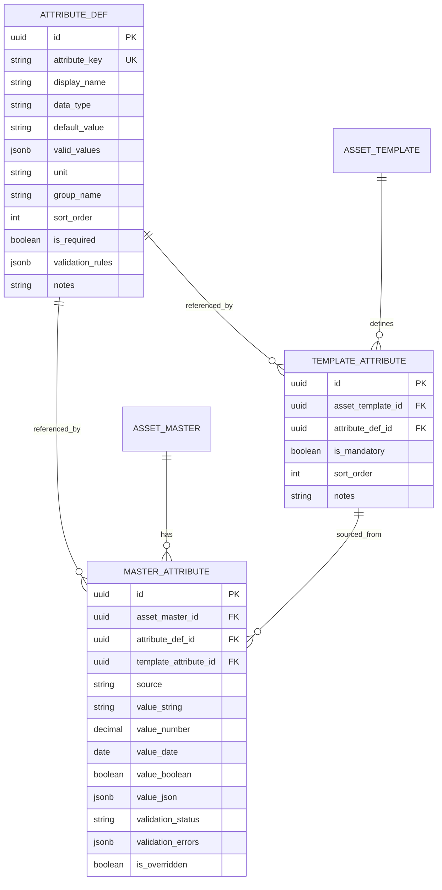
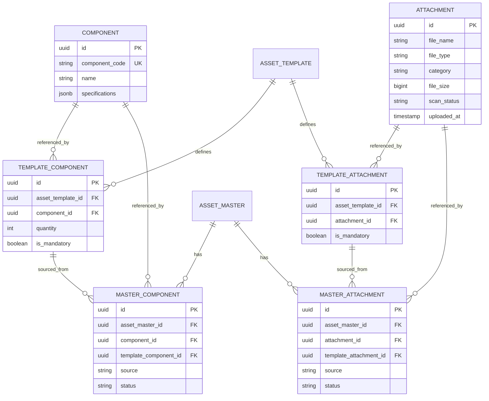
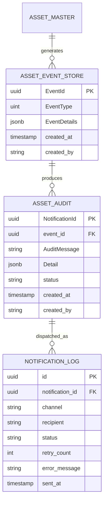
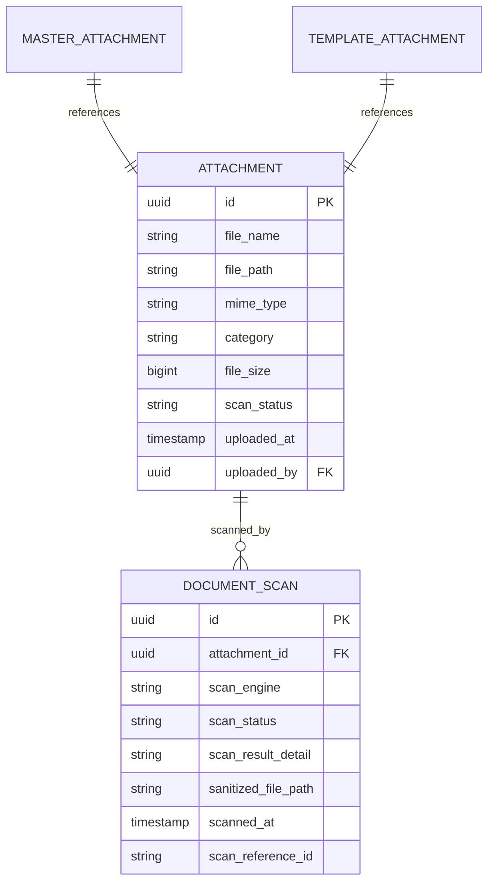

# Asset Master — ER Diagrams

> **Module:** Asset Master System | **Version:** 1.0

---

## 1. Complete ER Diagram with Full Models

> **Phase 1:** `GOS_BASE_TEMPLATE` seeds the registry from the GOS Register.
> **Phase 2:** `ASSET_TEMPLATE` extends a base template for a specific OEM, model, and version. `ASSET_MASTER` is always instantiated from an `ASSET_TEMPLATE`.

```mermaid
erDiagram
    GOS_BASE_TEMPLATE ||--o{ GOS_BASE_TEMPLATE : "parent_of"
    GOS_BASE_TEMPLATE ||--o{ ASSET_TEMPLATE : "extended_by"
    ASSET_TEMPLATE ||--o{ ASSET_TEMPLATE : "versioned_as"
    ASSET_TEMPLATE ||--o{ ASSET_MASTER : "instantiated_as"
    ASSET_TEMPLATE ||--o{ TEMPLATE_COMPONENT : "defines"
    ASSET_TEMPLATE ||--o{ TEMPLATE_ATTACHMENT : "defines"
    ASSET_TEMPLATE ||--o{ TEMPLATE_ATTRIBUTE : "defines"
    ASSET_MASTER ||--o{ ASSET_MASTER : "parent_of"
    ASSET_MASTER ||--o{ MASTER_COMPONENT : "has"
    ASSET_MASTER ||--o{ MASTER_ATTACHMENT : "has"
    ASSET_MASTER ||--o{ MASTER_ATTRIBUTE : "has"
    ASSET_MASTER ||--o{ ASSET_EVENT_STORE : "generates"
    ATTRIBUTE_DEF ||--o{ TEMPLATE_ATTRIBUTE : "referenced_by"
    ATTRIBUTE_DEF ||--o{ MASTER_ATTRIBUTE : "referenced_by"
    TEMPLATE_ATTRIBUTE ||--o{ MASTER_ATTRIBUTE : "sourced_from"
    COMPONENT ||--o{ TEMPLATE_COMPONENT : "referenced_by"
    COMPONENT ||--o{ MASTER_COMPONENT : "referenced_by"
    ATTACHMENT ||--o{ TEMPLATE_ATTACHMENT : "referenced_by"
    ATTACHMENT ||--o{ MASTER_ATTACHMENT : "references"
    ATTACHMENT ||--o{ DOCUMENT_SCAN : "scanned_by"
    TEMPLATE_COMPONENT ||--o{ MASTER_COMPONENT : "sourced_from"
    TEMPLATE_ATTACHMENT ||--o{ MASTER_ATTACHMENT : "sourced_from"
    ASSET_EVENT_STORE ||--o{ ASSET_AUDIT : "produces"
    ASSET_AUDIT ||--o{ NOTIFICATION_LOG : "dispatched_as"

    GOS_BASE_TEMPLATE {
        uuid id PK "GOS Register Base Record"
        uuid parent_id FK "null for root - GOS hierarchy"
        string gos_object_type UK "AG, AGV, AMS - Primary GOS identifier"
        string gos_object_id UK "AG#####, AGV##### - Full GOS Object ID"
        string gos_lv1_code "AG, AGV, AMS - Level 1"
        string gos_lv2_code "02, 03, 09, 24, 27, 80, 99 - Level 2"
        string gos_lv3_code "002, 010, 031, 083, 141, 213 - Level 3"
        string gos_lv4_code "072, 100, 158, 200, 230 - Level 4"
        string gos_lv5_code "119, P001, P002 - Level 5"
        int gos_object_level "200=Lv1, 300=Lv2, 400=Lv3, 500=Lv4, 600=Lv5"
        string gos_category "EQ, TOOL, CIV, FUEL"
        string gos_functional_type "Functional, Tool, Serial, Structural"
        string gos_equipment_type "Instrument, Electrical, Rotary, Static, Hydraulic, Structural"
        string gos_hierarchy_path "AG.02.131.100"
        int gos_hierarchy_level "1, 2, 3, 4, 5"
        string gos_parent_object_id "Parent GOS Object ID"
        boolean gos_is_tool "0=Equipment, 1=Tool"
        string display_name "Human-readable name"
        string description "GOS object description"
        string status "active, inactive, deprecated"
        jsonb gos_metadata "Additional GOS properties"
        uuid created_by
        timestamp created_at
        uuid updated_by
        timestamp updated_at
    }

    ASSET_TEMPLATE {
        uuid id PK "OEM Template ID"
        uuid gos_base_template_id FK "Source GOS base record"
        uuid parent_template_id FK "null for first version"
        string template_code UK "e.g. AG-KONECRANES-RTG-V1"
        string template_name "e.g. Konecranes RTG Electric V1"
        string oem_manufacturer "Konecranes, ABB, Siemens, etc"
        string oem_model "RTG-E, ACS880, etc"
        string oem_version "V1, V2, V3"
        boolean is_latest_version "true for current active version"
        boolean is_base_version "true for first OEM template"
        date effective_from "Template valid from"
        date effective_to "null = still active"
        string change_summary "What changed from parent version"
        string status "draft, active, deprecated, retired"
        jsonb specifications "OEM-specific technical specs"
        jsonb metadata
        uuid created_by
        timestamp created_at
        uuid updated_by
        timestamp updated_at
    }

    ASSET_MASTER {
        uuid id PK
        uuid asset_template_id FK "Reference to GOS Template"
        uuid parent_asset_id FK "Null for root assets"
        string asset_code UK "Unique asset instance identifier"
        string asset_name "Instance-specific name"
        string asset_description "Instance-specific description"
        string serial_number "Physical serial number"
        string manufacturer "Equipment manufacturer"
        string model "Equipment model"
        string location "Current physical location"
        string department "Owning department"
        string owner_user_id "Asset owner"
        string status "active, inactive, retired, maintenance"
        date installation_date
        date commissioning_date
        date warranty_end_date
        date lifecycle_start_date
        date lifecycle_end_date
        decimal acquisition_cost
        string acquisition_currency
        decimal current_value
        string asset_class "Classification based on template"
        string sub_class "Sub-classification"
        string criticality_level "critical, high, medium, low"
        boolean is_active
        jsonb metadata
        uuid created_by
        timestamp created_at
        uuid updated_by
        timestamp updated_at
    }

    ATTRIBUTE_DEF {
        uuid id PK
        string attribute_key UK
        string display_name
        string description
        string data_type "string, number, date, boolean, json, currency"
        string category
        string default_value
        jsonb valid_values
        string unit_of_measure
        string group_name
        int sort_order
        boolean is_required
        boolean is_searchable
        boolean is_filterable
        boolean is_editable
        jsonb validation_rules
        int max_length
        string regex_pattern
        boolean is_system
        string notes
        uuid created_by
        timestamp created_at
        uuid updated_by
        timestamp updated_at
    }

    TEMPLATE_ATTRIBUTE {
        uuid id PK
        uuid asset_template_id FK
        uuid attribute_def_id FK
        boolean is_mandatory
        boolean is_inherited
        int sort_order
        string display_label
        string help_text
        jsonb default_value_override
        string notes
        uuid created_by
        timestamp created_at
        uuid updated_by
        timestamp updated_at
    }

    MASTER_ATTRIBUTE {
        uuid id PK
        uuid asset_master_id FK
        uuid attribute_def_id FK
        uuid template_attribute_id FK
        string source "manual, template, system, imported"
        string value_string
        decimal value_number
        date value_date
        boolean value_boolean
        jsonb value_json
        string validation_status "valid, invalid, warning"
        jsonb validation_errors
        boolean is_overridden
        string override_reason
        uuid overridden_by
        timestamp overridden_at
        uuid created_by
        timestamp created_at
        uuid updated_by
        timestamp updated_at
    }

    COMPONENT {
        uuid id PK
        string component_code UK
        string component_name
        string description
        string category
        string manufacturer
        string model
        jsonb specifications
        string status
        boolean is_active
        uuid created_by
        timestamp created_at
        uuid updated_by
        timestamp updated_at
    }

    TEMPLATE_COMPONENT {
        uuid id PK
        uuid asset_template_id FK
        uuid component_id FK
        int quantity
        boolean is_mandatory
        boolean is_inheritable
        int sort_order
        jsonb configuration
        string notes
        uuid created_by
        timestamp created_at
        uuid updated_by
        timestamp updated_at
    }

    MASTER_COMPONENT {
        uuid id PK
        uuid asset_master_id FK
        uuid component_id FK
        uuid template_component_id FK
        string source "template, manual, system"
        string status "active, inactive, replaced"
        int quantity_installed
        date installation_date
        date removal_date
        string serial_number
        jsonb configuration_applied
        uuid created_by
        timestamp created_at
        uuid updated_by
        timestamp updated_at
    }

    ATTACHMENT {
        uuid id PK
        string file_name UK "per upload context"
        string file_path
        string mime_type
        string category "document, manual, certification, warranty, other"
        bigint file_size
        string file_hash
        string scan_status "pending, clean, threat_detected, failed, quarantined"
        string threat_name
        string storage_location
        boolean is_active
        uuid uploaded_by
        timestamp uploaded_at
        uuid created_by
        timestamp created_at
        uuid updated_by
        timestamp updated_at
    }

    TEMPLATE_ATTACHMENT {
        uuid id PK
        uuid asset_template_id FK
        uuid attachment_id FK
        boolean is_mandatory
        string attachment_type
        int sort_order
        string notes
        uuid created_by
        timestamp created_at
        uuid updated_by
        timestamp updated_at
    }

    MASTER_ATTACHMENT {
        uuid id PK
        uuid asset_master_id FK
        uuid attachment_id FK
        uuid template_attachment_id FK
        string source "template, manual, system"
        string status "active, archived, replaced"
        boolean is_visible
        string access_level "public, internal, restricted"
        uuid created_by
        timestamp created_at
        uuid updated_by
        timestamp updated_at
    }

    DOCUMENT_SCAN {
        uuid id PK
        uuid attachment_id FK
        string correlation_id UK
        string scan_engine "votiro, kaspersky, other"
        string scan_status "submitted, in_progress, completed, threat_detected, failed, timeout"
        string threat_name
        string threat_level "low, medium, high, critical"
        string scan_result_detail
        string sanitized_file_path
        int polling_attempts
        int max_polling_attempts
        timestamp scan_start_time
        timestamp scan_end_time
        timestamp next_poll_time
        string failure_reason
        jsonb scan_metadata
        uuid created_by
        timestamp created_at
        uuid updated_by
        timestamp updated_at
    }

    ASSET_EVENT_STORE {
        uuid event_id PK
        string event_type "AssetCreated, AssetUpdated, AssetDeleted, AttachmentUploaded, DocumentScanStarted, DocumentScanCompleted"
        string correlation_id UK
        uuid source_entity_id
        string source_entity_type
        jsonb event_details
        jsonb metadata
        string status "stored, processed, failed"
        uuid created_by
        timestamp created_at
    }

    ASSET_AUDIT {
        uuid audit_id PK
        uuid event_id FK
        string entity_type
        uuid entity_id
        string action "CREATE, UPDATE, DELETE, SCAN, NOTIFY"
        string old_values
        string new_values
        string change_summary
        string user_id
        string ip_address
        string user_agent
        jsonb details
        string status "SUCCESS, FAILURE"
        string error_message
        uuid created_by
        timestamp created_at
    }

    NOTIFICATION_LOG {
        uuid notification_id PK
        uuid audit_id FK
        uuid event_id FK
        string notification_type "ui_push, email, sms, webhook"
        string recipient "user_id, email, phone"
        string status "pending, sent, delivered, failed, bounced"
        int retry_count
        int max_retries
        string error_message
        jsonb notification_payload
        timestamp sent_at
        timestamp delivered_at
        string delivery_reference
        uuid created_by
        timestamp created_at
    }
```

---

## 2. Core Asset Domain

> Shows the three-tier hierarchy: **GOS Base → OEM Template (versioned) → Asset Instance**

---

## 3. Attributes Domain

---

## 4. Components & Attachments Domain

---

## 5. Event & Audit Domain

---

## 6. Document Scan Domain

