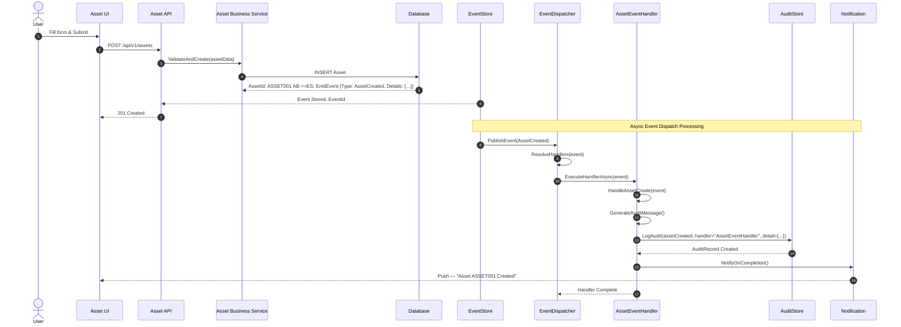
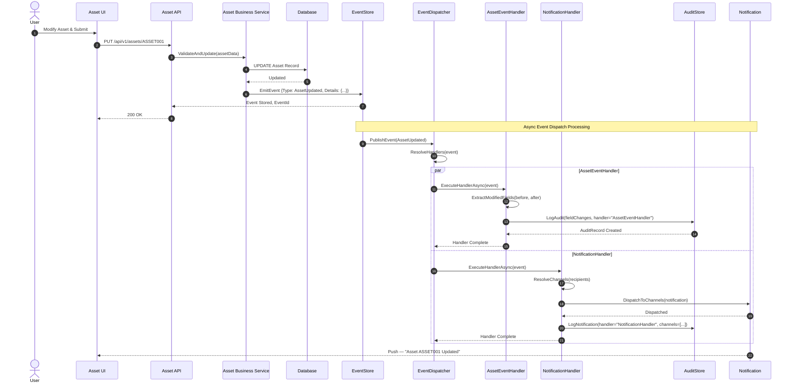
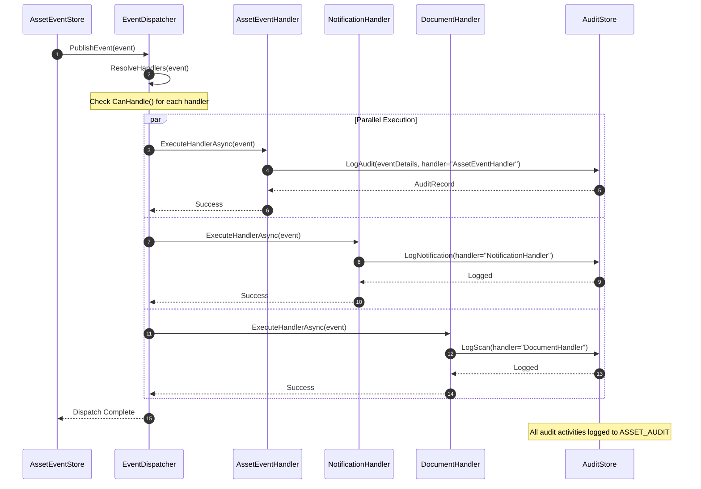
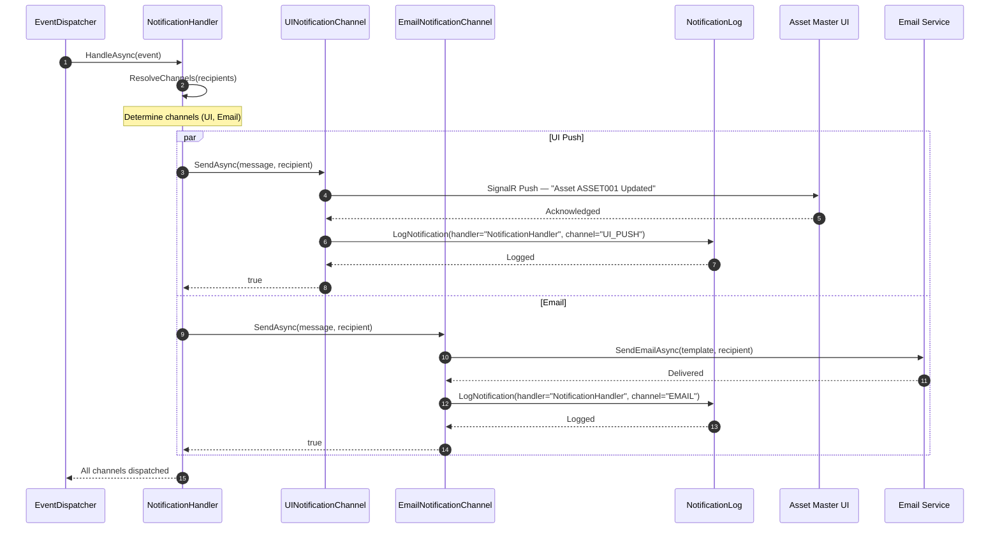

# Asset Master — Sequence Diagrams

> **Module:** Asset Master System | **Version:** 1.0

---

## 1. Asset Create with Event Dispatcher



---

## 2. Asset Update with Event Dispatch



---

## 3. EventDispatcher Coordination



---

## 4. Notification Handler Multi-Channel Dispatch



---

## 5. Document Upload & Direct Votiro Scan

```mermaid
sequenceDiagram
    autonumber
    actor User
    participant UI as Asset Master UI
    participant API as Asset API
    participant DH as DocumentHandler
    participant ES as EventStore
    participant VOTIRO as Votiro CDR API
    participant DB as Database
    participant ED as EventDispatcher
    participant NH as NotificationHandler
    participant Audit as AuditStore

    User->>UI: Upload file (e.g. Manual.pdf)
    UI->>API: POST /api/v1/assets/{assetId}/attachments
    API->>DH: UploadAndScanAsync(file, metadata)

    DH->>VOTIRO: SubmitFileAsync(file, metadata)
    VOTIRO-->>DH: VotiroResponse {correlationId}
    
    DH->>DB: CreateAttachment {fileName, correlationId, status=Pending}
    DB-->>DH: Attachment Created
    DH->>DB: CreateDocumentScan {correlationId, status=Submitted}
    DB-->>DH: DocumentScan Created

    Note over DH,ES: Emit Document Scan Event
    DH->>ES: EmitEvent(DocumentScanStarted, correlationId)
    ES-->>API: Event Stored, EventId
    
    DH-->>API: Submitted for Scan
    API-->>UI: 202 Accepted {attachmentId, correlationId}
    UI-->>User: ⏳ "File submitted for scanning..."

    Note over ES,ED: EventDispatcher triggers DocumentHandler polling
    ES->>ED: PublishEvent(DocumentScanStarted, correlationId)
    ED->>ED: ResolveHandlers(DocumentScanStarted)
    ED->>DH: ExecuteHandlerAsync(DocumentScanStarted)

    Note over DH,DB: Async Polling & Processing
    loop Poll Every N Seconds (Max 30)
        DH->>DB: GetDocumentScan(correlationId)
        DB-->>DH: DocumentScan {status, pollingAttempts}
        
        opt Scan Complete
            DH->>VOTIRO: GetScanResultAsync(correlationId)
            VOTIRO-->>DH: ScanResult {status, threat}
            
            alt Threat Detected
                DH->>DB: UpdateAttachment {status=ThreatDetected}
                DH->>DB: UpdateDocumentScan {status=ThreatDetected}
            else Clean
                DH->>DB: UpdateAttachment {status=Clean}
                DH->>DB: UpdateDocumentScan {status=Clean}
            else Failed
                DH->>DB: UpdateDocumentScan {status=Failed}
            end
            break Exit Loop
        end
    end

    Note over DH,ES: Emit Scan Completion Event
    DH->>ES: EmitEvent(DocumentScanCompleted, result)
    ES-->>DH: Event Stored
    
    DH->>Audit: LogScan(handler="DocumentHandler", scan_result)
    Audit-->>DH: Logged    Note over ES,NH: EventDispatcher routes to NotificationHandler
    ES->>ED: PublishEvent(DocumentScanCompleted)
    ED->>ED: ResolveHandlers(DocumentScanCompleted)
    ED->>NH: ExecuteHandlerAsync(DocumentScanCompleted)
    NH->>Audit: LogNotification(handler="NotificationHandler", result)
    Audit-->>NH: Logged
    NH->>UI: SignalR: ✅/❌ "Manual.pdf scan complete"
    UI-->>User: Display result
```
