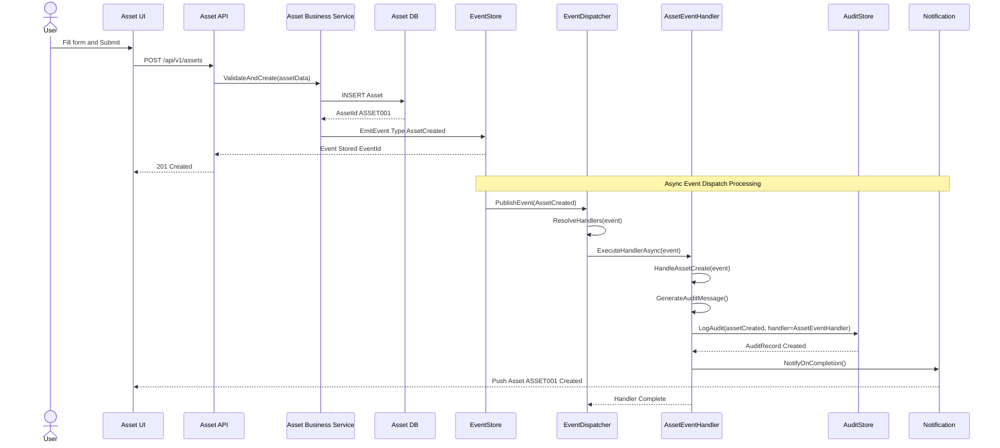
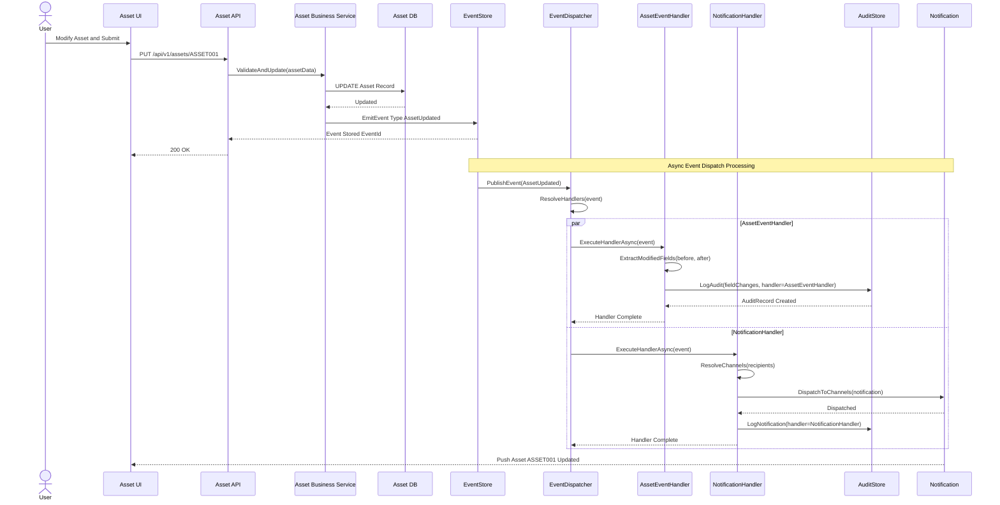
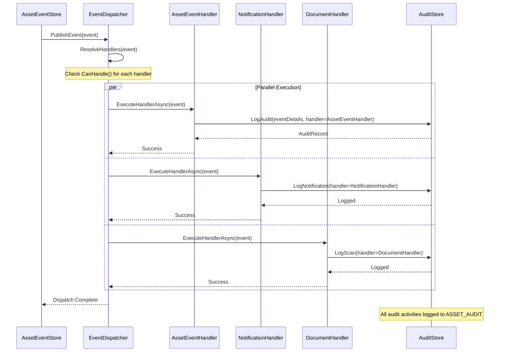
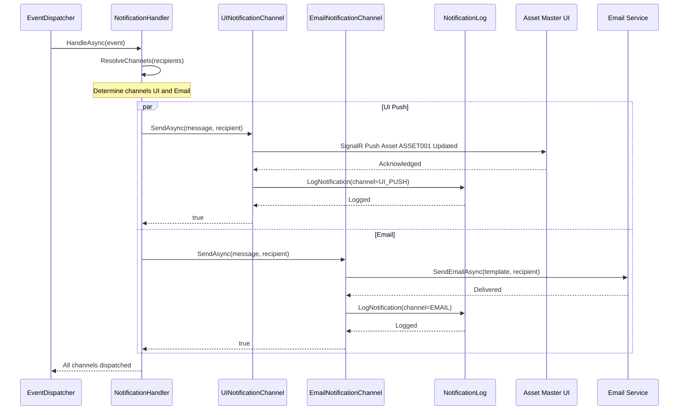
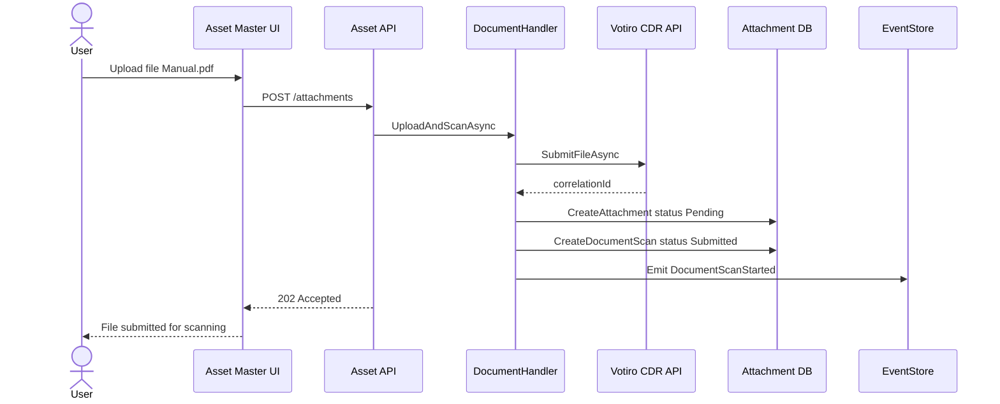
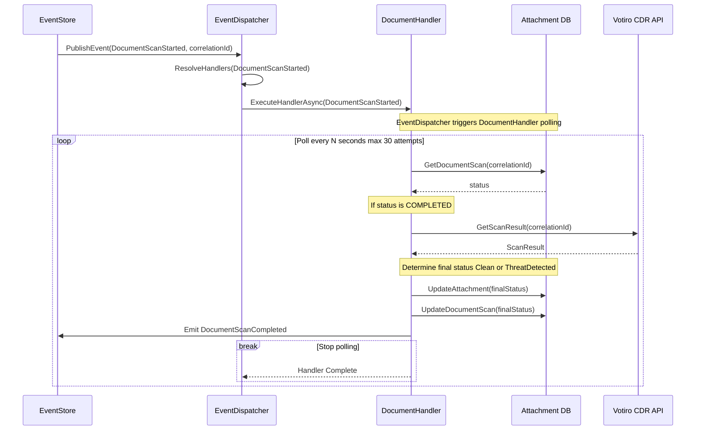
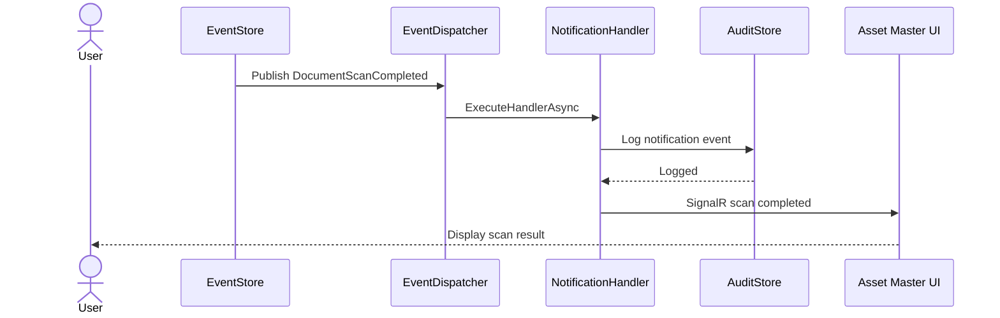

# Asset Master - Sequence Diagrams

> **Module:** Asset Master System | **Version:** 1.0

---

## 1. Asset Create with Event Dispatcher

---

## 2. Asset Update with Event Dispatch

---

## 3. EventDispatcher Coordination

---

## 4. Notification Handler Multi-Channel Dispatch

---

## 5. Document Upload and Direct Votiro Scan

### 5a. Upload and Submit

### 5b. Background Polling

### 5c. Scan Completion Notification

