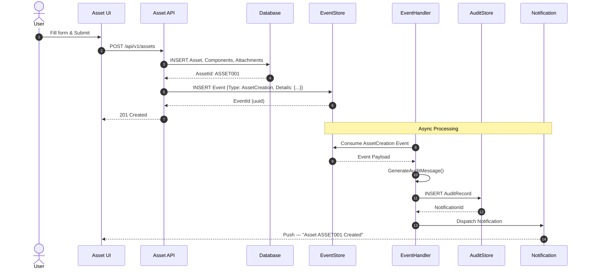
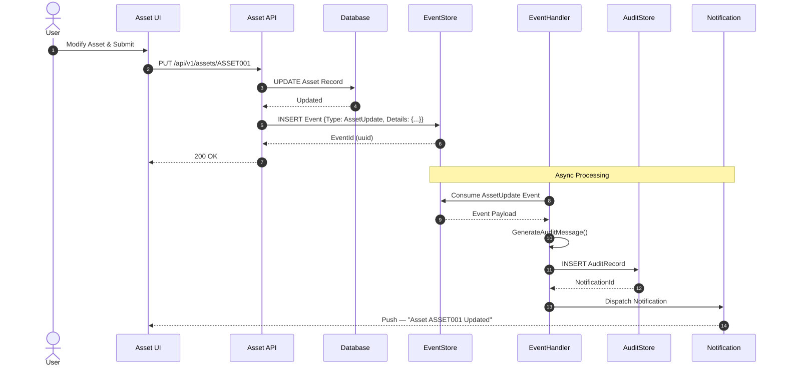
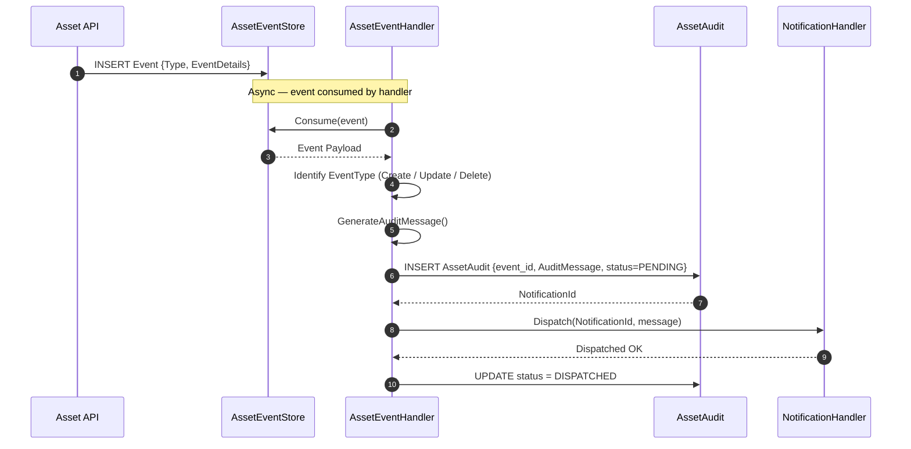
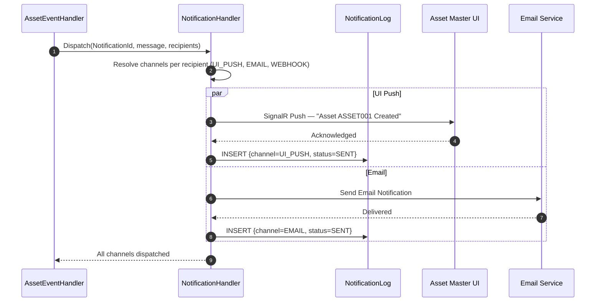
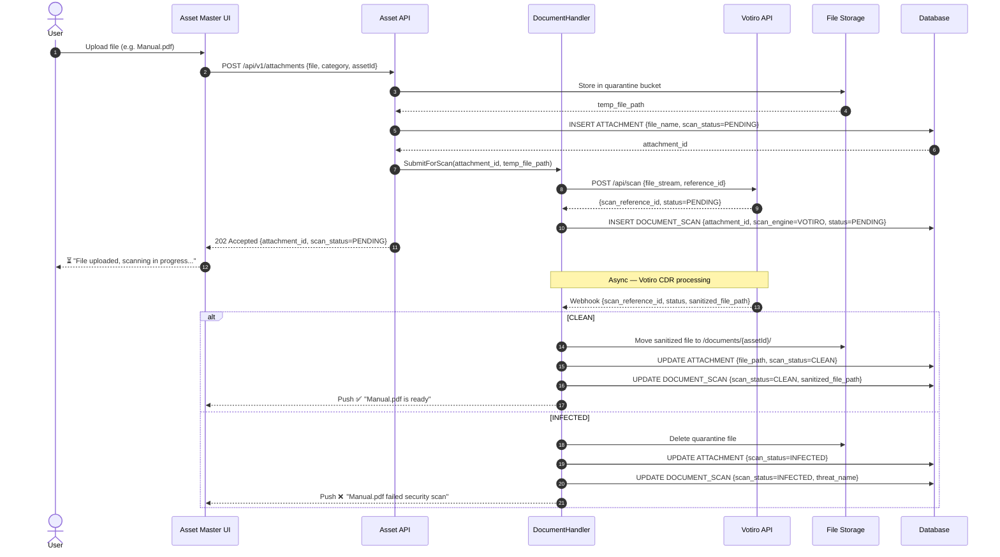

# Asset Master — Sequence Diagrams

> **Module:** Asset Master System | **Version:** 1.0

---

## 1. Asset Create

---

## 2. Asset Update

---

## 3. Audit Handler Flow

---

## 4. Notification Handler Flow

---

## 5. Document Upload with Votiro Scan

