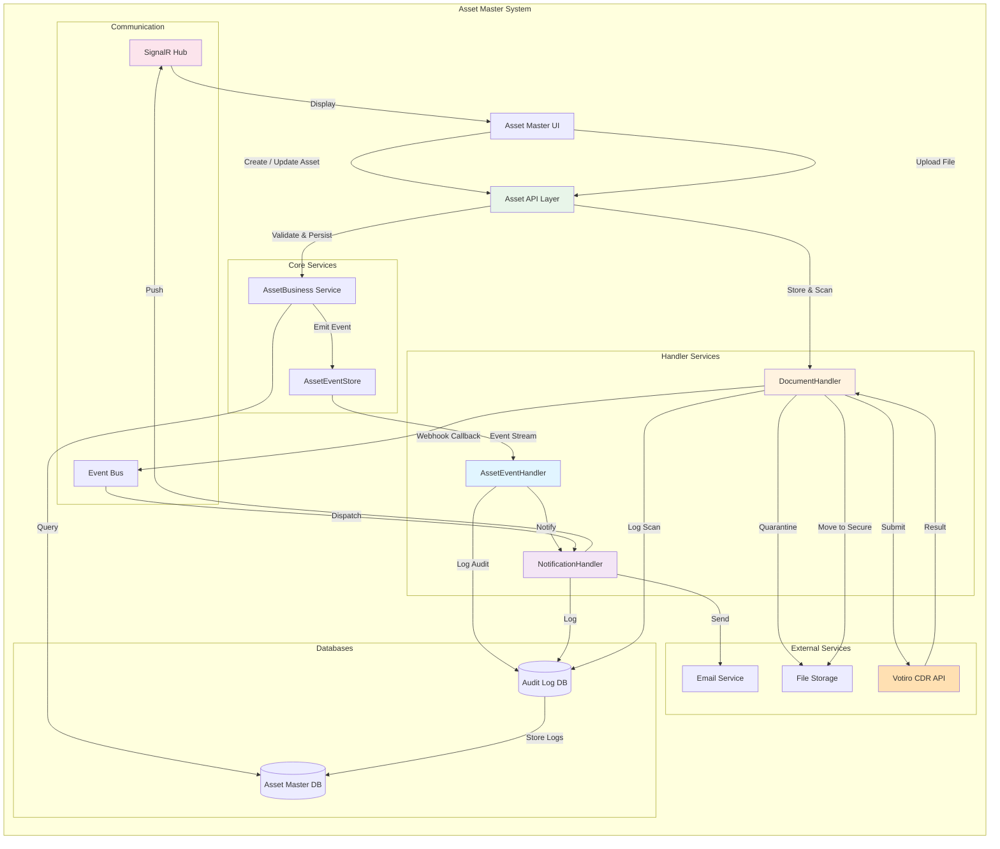
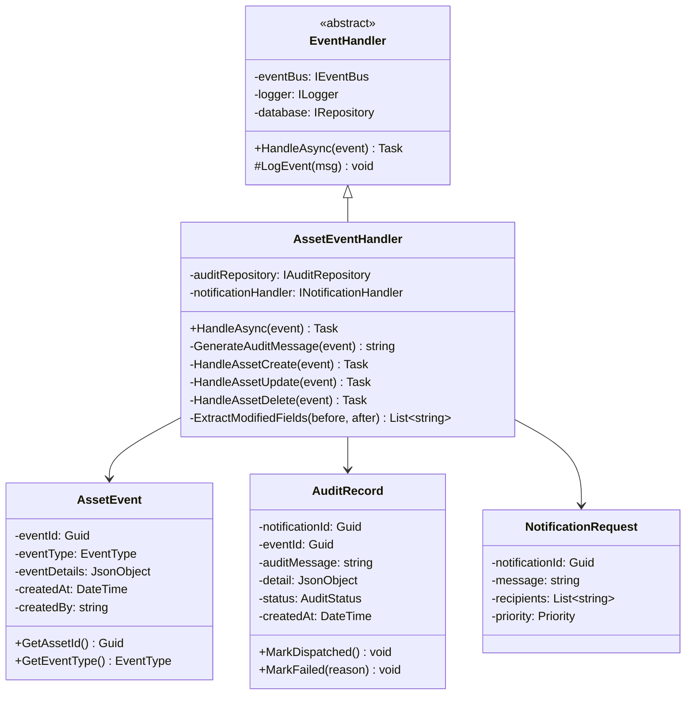
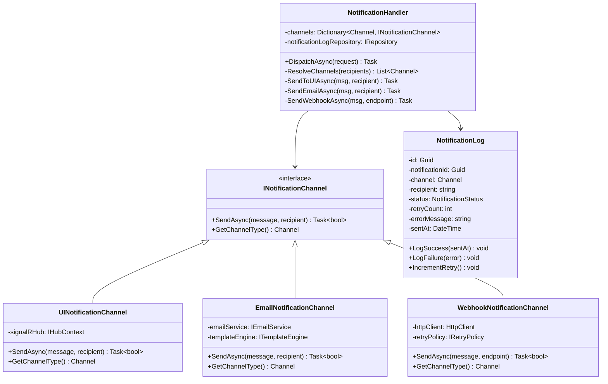
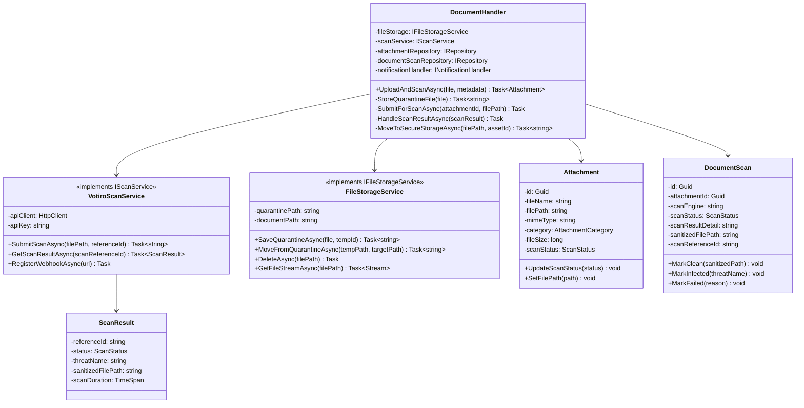

# Asset Master — Component & Class Diagrams

> **Module:** Asset Master System | **Version:** 1.0

---

## 1. Overall System Architecture

---

## 2. AssetEventHandler Class Diagram

---

## 3. NotificationHandler Class Diagram

---

## 4. DocumentHandler Class Diagram

