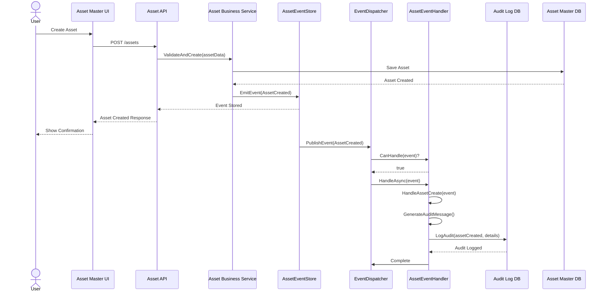
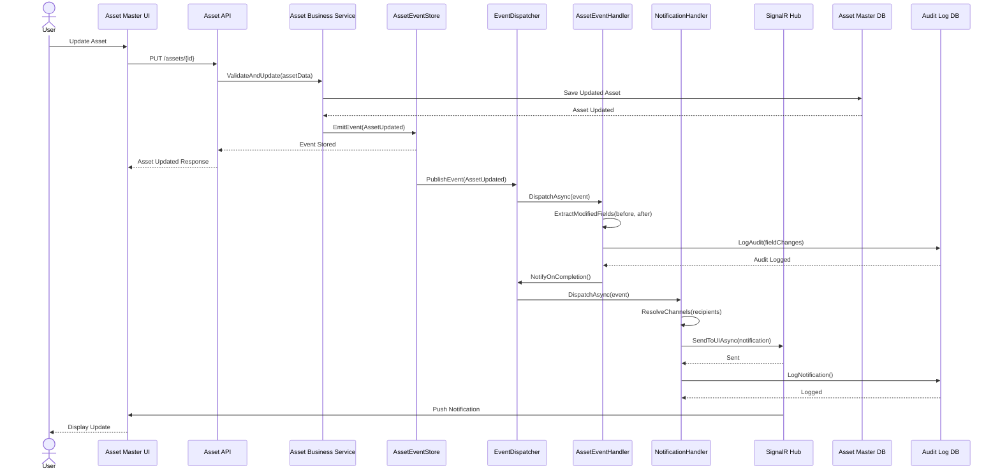
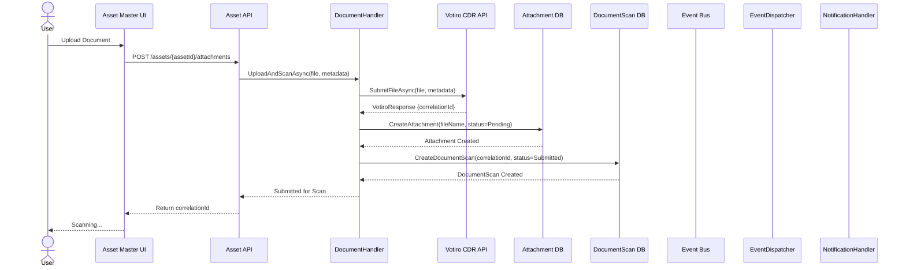
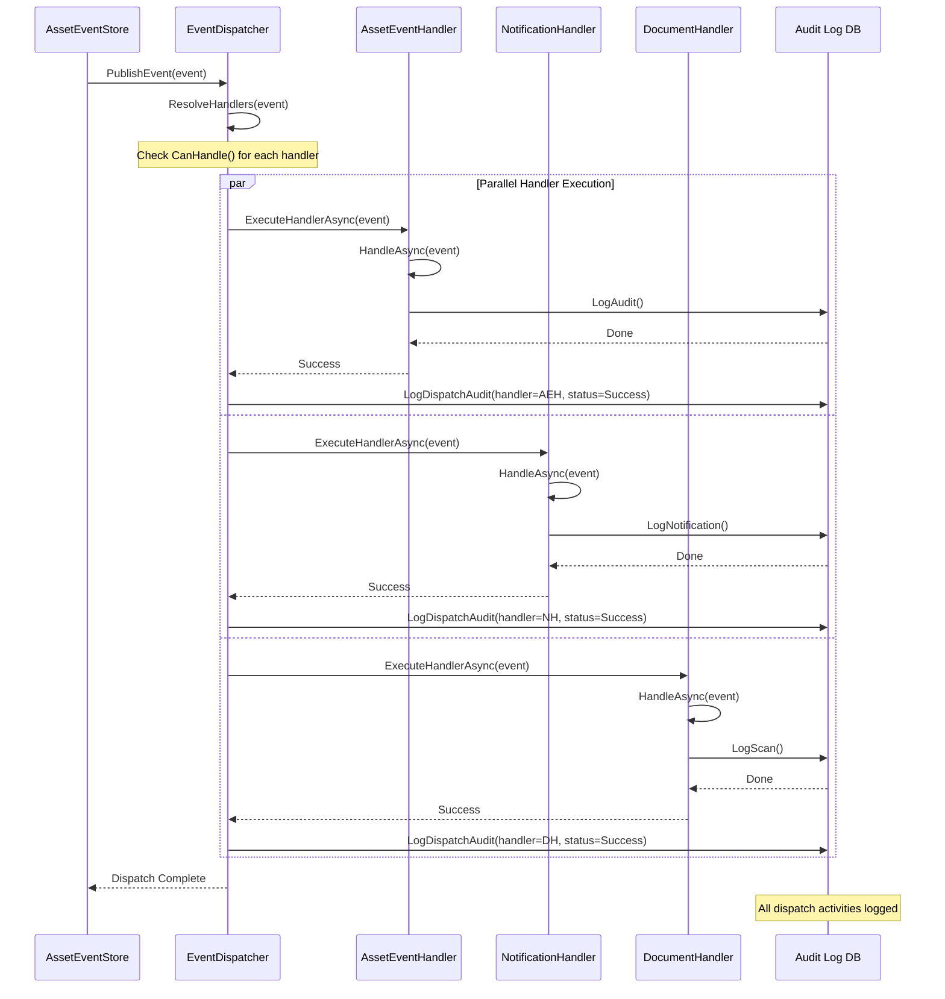
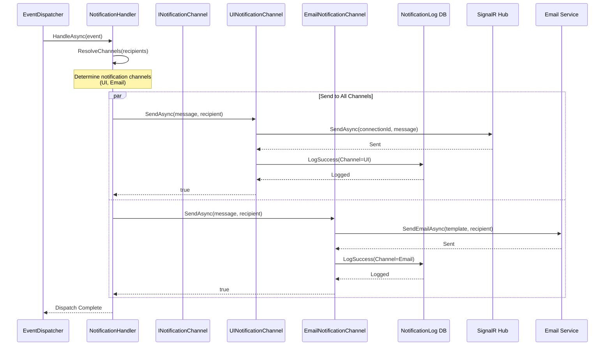
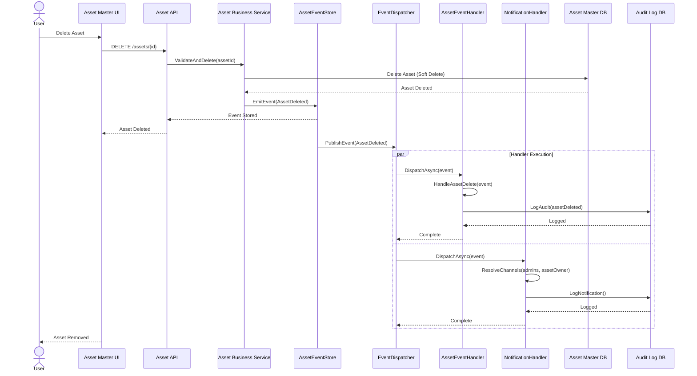

# Asset Master — Sequence Diagrams

> **Module:** Asset Master System | **Version:** 1.0

---

## 1. Asset Creation Flow



---

## 2. Asset Update with Event Dispatch



---

## 3. Document Upload & Scan Flow



---

## 4. Document Scan Result Polling & Completion

```mermaid
sequenceDiagram
    participant DH as DocumentHandler
    participant SCANDB as DocumentScan DB
    participant VOTIRO as Votiro CDR API
    participant ATTACHDB as Attachment DB
    participant AUDITDB as Audit Log DB
    participant WEBHOOK as Event Bus
    participant ED as EventDispatcher
    participant NH as NotificationHandler
    participant SIGNALR as SignalR Hub
    participant UI as Asset Master UI

    loop Poll Every N Seconds
        DH->>SCANDB: GetDocumentScan(correlationId)
        SCANDB-->>DH: DocumentScan {status, pollingAttempts}
        
        alt Status Not Complete
            DH->>VOTIRO: GetScanResultAsync(correlationId)
            VOTIRO-->>DH: ScanResult
            
            alt Threat Detected
                DH->>ATTACHDB: UpdateAttachment(status=ThreatDetected)
                DH->>SCANDB: MarkThreatDetected(threatName)
                DH->>AUDITDB: LogScan(threatDetected)
            else Clean
                DH->>ATTACHDB: UpdateAttachment(status=Clean)
                DH->>SCANDB: MarkClean()
                DH->>AUDITDB: LogScan(clean)
            else Failed
                DH->>SCANDB: MarkFailed(reason)
                DH->>AUDITDB: LogScan(failed)
            end
            
            DH->>WEBHOOK: PublishEvent(ScanCompleted)
        else Max Retries Exceeded
            DH->>SCANDB: MarkFailed(maxRetriesExceeded)
            break Stop Polling
        end
    end

    WEBHOOK->>ED: DispatchEvent(ScanCompleted)
    ED->>NH: DispatchAsync(event)
    NH->>NH: ResolveChannels(assetOwner)
    NH->>SIGNALR: SendToUIAsync(scanResult)
    SIGNALR-->>UI: Push Result
    NH->>AUDITDB: LogNotification()
    UI-->>User: Display Scan Result
```

---

## 5. EventDispatcher Coordination Flow



---

## 6. Notification Dispatch to Multiple Channels



---

## 7. Asset Deletion with Cascading Events



---

## 8. Error Handling in Document Scan

```mermaid
sequenceDiagram
    participant DH as DocumentHandler
    participant VOTIRO as Votiro CDR API
    participant SCANDB as DocumentScan DB
    participant AUDITDB as Audit Log DB
    participant ED as EventDispatcher
    participant NH as NotificationHandler

    DH->>VOTIRO: SubmitFileAsync(file)
    
    alt Votiro Service Available
        VOTIRO-->>DH: {correlationId}
        DH->>SCANDB: CreateDocumentScan(correlationId)
    else Votiro Service Error
        VOTIRO-->>DH: Error
        DH->>SCANDB: CreateDocumentScan(status=Failed)
        DH->>AUDITDB: LogScan(error=VotiroServiceError)
        DH->>ED: PublishEvent(ScanFailed)
        ED->>NH: DispatchAsync(event)
        NH->>NH: NotifyError(assetOwner, errorMsg)
        NH-->>DH: Notified
    end

    loop Polling
        DH->>VOTIRO: GetScanResultAsync(correlationId)
        
        alt Polling Successful
            VOTIRO-->>DH: ScanResult
            DH->>SCANDB: UpdateStatus(result)
        else Polling Failed - Retry
            VOTIRO-->>DH: Error
            DH->>SCANDB: IncrementPollingAttempt()
            
            alt Max Retries Not Exceeded
                Note over DH: Continue polling in next cycle
            else Max Retries Exceeded
                DH->>SCANDB: MarkFailed(maxRetriesExceeded)
                DH->>AUDITDB: LogScan(failed)
                DH->>ED: PublishEvent(ScanFailed)
                break Stop Polling
            end
        end
    end
```
