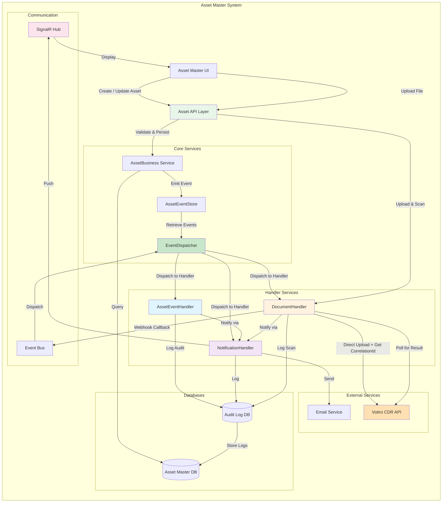
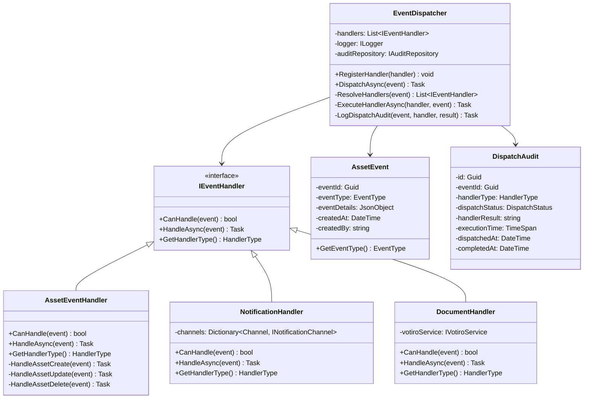

# Asset Master — Component & Class Diagrams

> **Module:** Asset Master System | **Version:** 1.0

---

## 1. Overall System Architecture



---

## 2. Handler Base Architecture

```mermaid
classDiagram
    class BaseHandler {
        <<abstract>>
        -eventBus: IEventBus
        -logger: ILogger
        -auditRepository: IAuditRepository
        #HandleAsync(event) Task
        #LogAudit(handlerName, message, detail) Task
        #PublishEvent(event) Task
        #NotifyOnCompletion(notification) Task
    }

    class AssetEventHandler {
        -notificationHandler: INotificationHandler
        +HandleAsync(event) Task
        -HandleAssetCreate(event) Task
        -HandleAssetUpdate(event) Task
        -HandleAssetDelete(event) Task
        -ExtractModifiedFields(before, after) List~string~
    }

    class NotificationHandler {
        -channels: Dictionary~Channel, INotificationChannel~
        -notificationLogRepository: IRepository
        +HandleAsync(request) Task
        -ResolveChannels(recipients) List~Channel~
        -DispatchToChannels(msg, recipients) Task
    }

    class DocumentHandler {
        -votiroService: IVotiroService
        -attachmentRepository: IRepository
        -documentScanRepository: IRepository
        +HandleAsync(file, metadata) Task
        -SubmitForScanAsync(file) Task~string~
        -PollScanResultAsync(correlationId) Task
        -HandleScanCompletion(result) Task
    }

    BaseHandler <|-- AssetEventHandler
    BaseHandler <|-- NotificationHandler
    BaseHandler <|-- DocumentHandler

    class AssetEvent {
        -eventId: Guid
        -eventType: EventType
        -eventDetails: JsonObject
        -createdAt: DateTime
        -createdBy: string
    }

    class AuditRecord {
        -auditId: Guid
        -handlerName: string
        -referenceId: Guid
        -auditMessage: string
        -detail: JsonObject
        -status: AuditStatus
        -createdAt: DateTime
    }    AssetEventHandler --> AssetEvent
    AssetEventHandler --> AuditRecord
    NotificationHandler --> AuditRecord
    DocumentHandler --> AuditRecord
```

---

## 3. EventDispatcher & Handler Coordination



---

## 4. NotificationHandler Class Diagram

```mermaid
classDiagram
    class NotificationHandler {
        -channels: Dictionary~Channel, INotificationChannel~
        -notificationLogRepository: IRepository
        +HandleAsync(request) Task
        -ResolveChannels(recipients) List~Channel~
        -SendToUIAsync(msg, recipient) Task
        -SendEmailAsync(msg, recipient) Task
    }

    class INotificationChannel {
        <<interface>>
        +SendAsync(message, recipient) Task~bool~
        +GetChannelType() Channel
    }

    class UINotificationChannel {
        -signalRHub: IHubContext
        +SendAsync(message, recipient) Task~bool~
        +GetChannelType() Channel
    }

    class EmailNotificationChannel {
        -emailService: IEmailService
        -templateEngine: ITemplateEngine
        +SendAsync(message, recipient) Task~bool~
        +GetChannelType() Channel
    }

    class NotificationLog {
        -id: Guid
        -notificationId: Guid
        -channel: Channel
        -recipient: string
        -status: NotificationStatus
        -retryCount: int
        -errorMessage: string
        -sentAt: DateTime
        +LogSuccess(sentAt) void
        +LogFailure(error) void
        +IncrementRetry() void
    }---

## 5. DocumentHandler & Votiro Integration

```mermaid
classDiagram
    class DocumentHandler {
        -votiroService: IVotiroService
        -attachmentRepository: IRepository
        -documentScanRepository: IRepository
        -notificationHandler: INotificationHandler
        +UploadAndScanAsync(file, metadata) Task~Attachment~
        -SubmitForScanAsync(file, metadata) Task~string~
        -PollScanStatusAsync(correlationId) Task~ScanResult~
        -HandleScanCompletion(result) Task
        -NotifyScanResult(attachment, result) Task
    }

    class IVotiroService {
        <<interface>>
        +SubmitFileAsync(file, metadata) Task~VotiroResponse~
        +GetScanResultAsync(correlationId) Task~ScanResult~
    }

    class VotiroService {
        <<implements IVotiroService>>
        -apiClient: HttpClient
        -apiKey: string
        -baseUrl: string
        +SubmitFileAsync(file, metadata) Task~VotiroResponse~
        +GetScanResultAsync(correlationId) Task~ScanResult~
        -BuildAuthHeaders() Dictionary~string, string~
    }

    class VotiroResponse {
        -correlationId: string
        -status: string
        -message: string
        -timestamp: DateTime
    }

    class ScanResult {
        -correlationId: string
        -status: ScanStatus
        -threatDetected: bool
        -threatName: string
        -scanDuration: TimeSpan
        -processedAt: DateTime
    }

    class Attachment {
        -id: Guid
        -fileName: string
        -mimeType: string
        -fileSize: long
        -correlationId: string
        -scanStatus: ScanStatus
        -scanResult: string
        -assetId: Guid
        +UpdateScanStatus(status) void
        +SetCorrelationId(id) void
        +MarkScanned(result) void
    }

    class DocumentScan {
        -id: Guid
        -attachmentId: Guid
        -correlationId: string
        -scanStatus: ScanStatus
        -scanResultDetail: string
        -threatDetected: bool
        -threatName: string
        -pollingAttempts: int
        -lastPolledAt: DateTime
        +MarkClean() void
        +MarkThreatDetected(threat) void
        +MarkFailed(reason) void
        +IncrementPollingAttempt() void
    }

    DocumentHandler --> IVotiroService
    DocumentHandler --> Attachment
    DocumentHandler --> DocumentScan
    DocumentHandler --> VotiroResponse
    IVotiroService --> VotiroResponse
    IVotiroService --> ScanResult
    DocumentScan --> ScanResult
```
