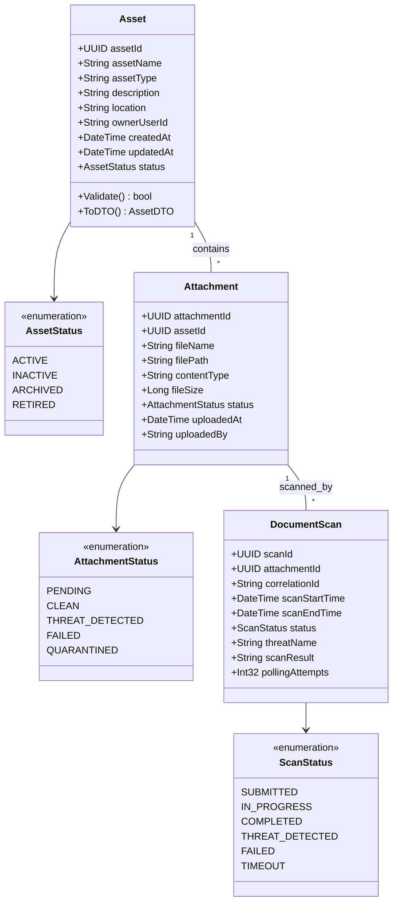
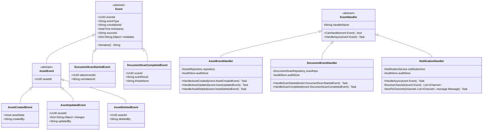
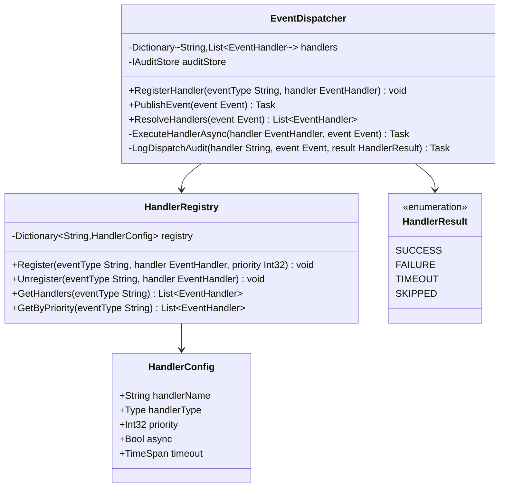
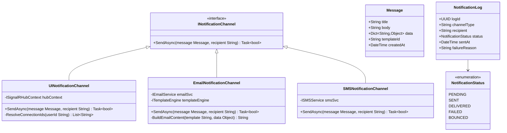
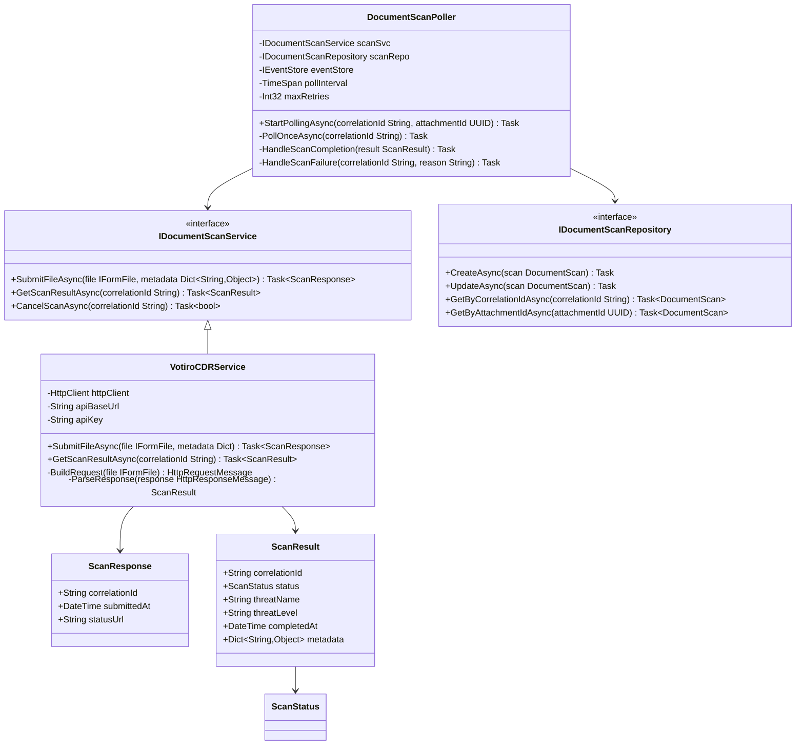
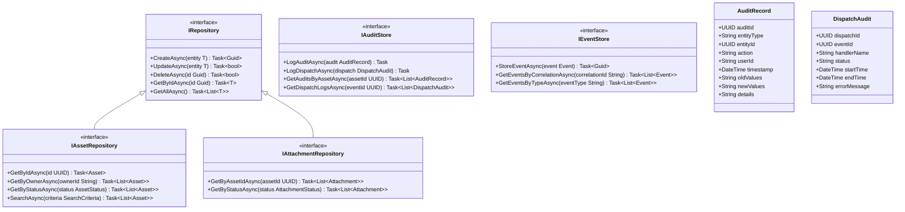
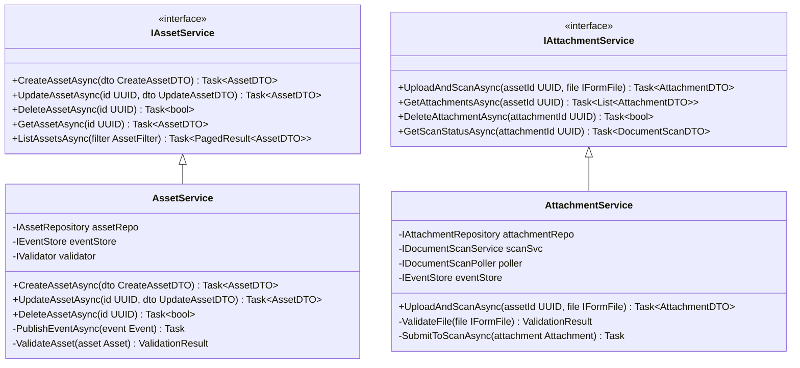
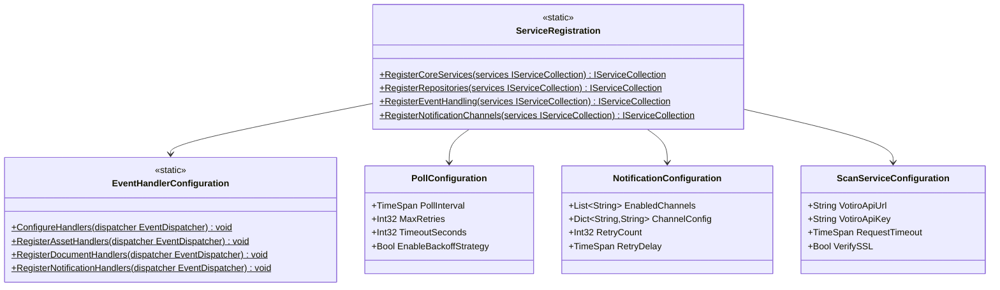

# Asset Master — Component & Class Diagrams

> **Module:** Asset Master System | **Version:** 1.0

---

## 1. Core Domain Models

---

## 2. Event & Handler Architecture

---

## 3. Event Dispatcher & Registry

---

## 4. Notification System

---

## 5. Document Scanning Integration

---

## 6. Repository & Data Access

---

## 7. Service Layer

---

## 8. Dependency Injection & Configuration

